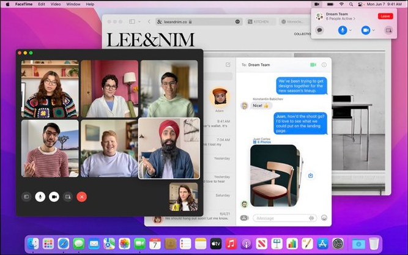

# Sistemas Operativos: Mac OS | Actividad 1: Sistemas operativos comunes y aplicaciones

_Origen: `sistemas_operativos_mac_os.html` del SCORM._

Sistemas Operativos: Mac OS | Actividad 1: Sistemas operativos comunes y aplicaciones 

document.body.className+=" js";jQuery(function(){loadPage()})

# Sistemas Operativos: Mac OS

**Mac OS**

Sistema Operativo de la marca **Apple** utilizado en sus **ordenadores de sobremesa y portátiles**. Es **de pago** y **sólo puede utilizarse de manera legal sobre el hardware de Apple**. Está **basado en Unix** (muy relacionado con Linux) y utiliza un **gestor de ventanas** **para** construir **su interfaz gráfica**. 

**Logo de Mac OS**

Hay muchas versiones de Mac OS. Entre las **más recientes** tenemos **Mac OS 12.0** siendo su nombre en código '**Monterey**'.  

**Escritorio de Mac OS 12.0 (Monterey)**

En la **parte inferior de la imagen** puede observarse un **conjunto de iconos llamados dock** que sirve para tener acceso a aplicaciones y otros recursos del sistema así como para saber qué aplicaciones están en ejecución en ese momento y poder administrarlas.  

Debido a que Mac OS **sólo se comercializa sobre el hardware de Apple**, y que éste es bien conocido, **el S.O. está optimizado para su arquitectura** y cuenta con un acceso más directo a los recursos, **lo que se traduce en un mejor rendimiento** **en aplicaciones exigentes como** pueden ser de **diseño gráfico o edición de video**. Es por este motivo que muchos diseñadores y artistas utilizan la marca Apple para sus diseños.

En cuanto a la incidencia de virus, se considera que **no existen gran cantidad de virus**. **Esto no es debido a su nivel de seguridad**, **sino a** su bajo nivel de ataques recibidos debido a **que es un sistema minoritario** y es mucho más rentable como hacker realizar ataques a sistemas Windows que cuentan con un mayor número de usuarios.

## Actividad

**EJERCICIO 3: RELACIÓN 1**

**Realiza este ejercicio en tu libreta digital que has descargado desde la plataforma Web. Recuerda que más tarde el profesor puede preguntarte.**

[Creado con eXeLearning (Ventana nueva)](https://exelearning.net/)

