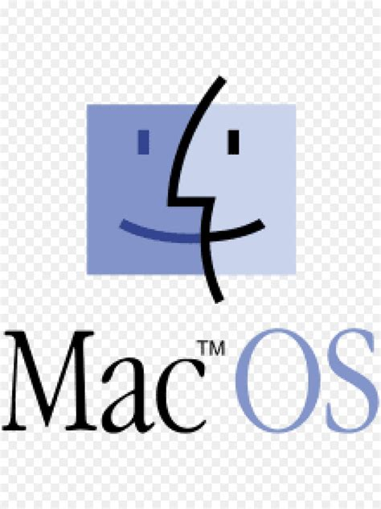
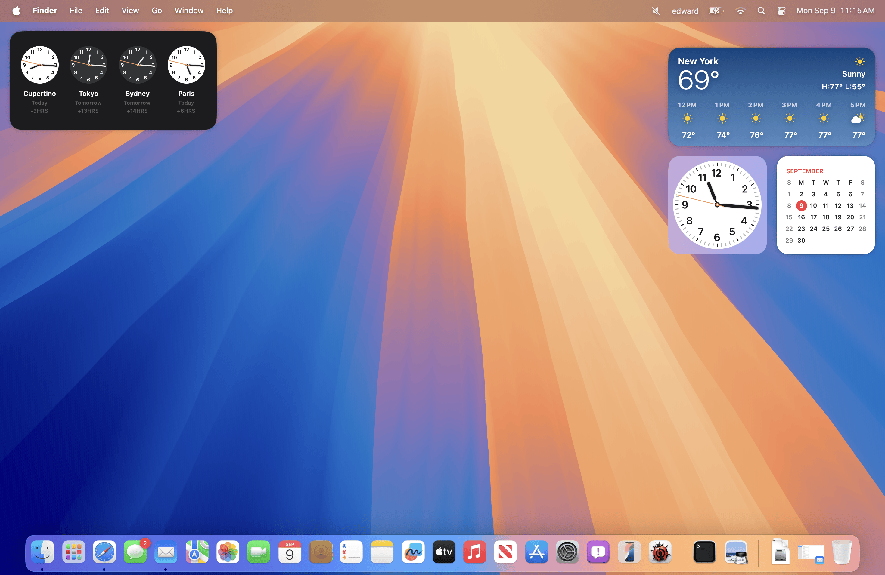

# Sistemas Operativos: Mac OS

Sistema Operativo de la marca **Apple** utilizado en sus **ordenadores de sobremesa y portátiles**. Es **de pago** y **sólo puede utilizarse de manera legal sobre el hardware de Apple**. Está **basado en Unix** (muy relacionado con Linux) y utiliza un **gestor de ventanas** **para** construir **su interfaz gráfica**. 

**Logo de Mac OS**
{: .centrado}

Hay muchas versiones de Mac OS. Entre las **más recientes** tenemos **Mac OS 15.0** siendo su nombre en código '**Sequoia**'.  

**Escritorio de Mac OS 15.0 (Sequoia)**
{: .centrado}

En la **parte inferior de la imagen** puede observarse un **conjunto de iconos llamados dock** que sirve para tener acceso a aplicaciones y otros recursos del sistema así como para saber qué aplicaciones están en ejecución en ese momento y poder administrarlas.  

Debido a que Mac OS **sólo se comercializa sobre el hardware de Apple**, y que éste es bien conocido, **el S.O. está optimizado para su arquitectura** y cuenta con un acceso más directo a los recursos, **lo que se traduce en un mejor rendimiento** **en aplicaciones exigentes como** pueden ser de **diseño gráfico o edición de video**. Es por este motivo que muchos diseñadores y artistas utilizan la marca Apple para sus diseños.

En cuanto a la incidencia de virus, se considera que **no existen gran cantidad de virus**. **Esto no es debido a su nivel de seguridad**, **sino a** su bajo nivel de ataques recibidos debido a **que es un sistema minoritario** y es mucho más rentable como hacker realizar ataques a sistemas Windows que cuentan con un mayor número de usuarios.

## Actividad

> **EJERCICIO 3:** Realiza este ejercicio en tu libreta digital que has descargado desde la plataforma Web. Recuerda que más tarde el profesor puede preguntarte.
{: .alert-success}

[👈 Atrás](./sistemas_operativos_linux_y_sus_distribuciones.md)
[👉 Siguiente](./sistemas_operativos_para_smartphone)