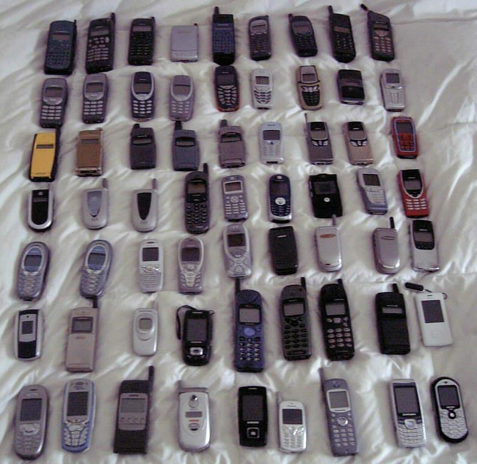
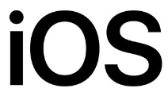
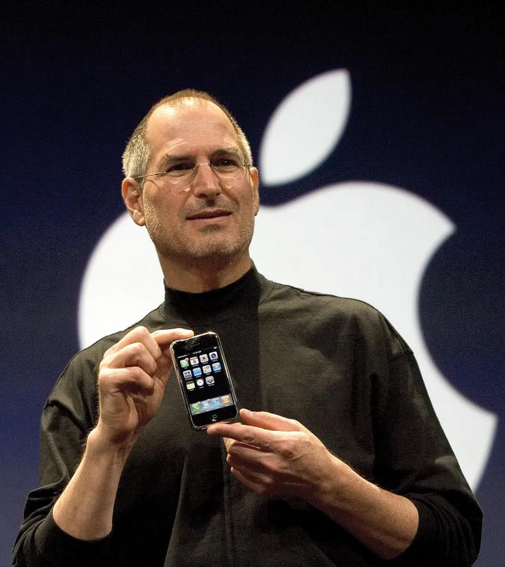
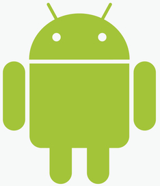
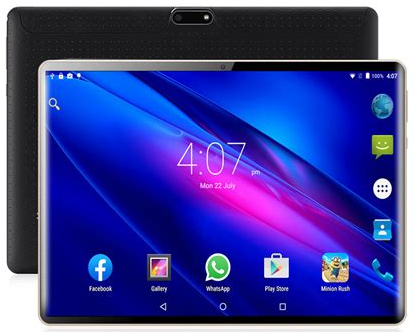
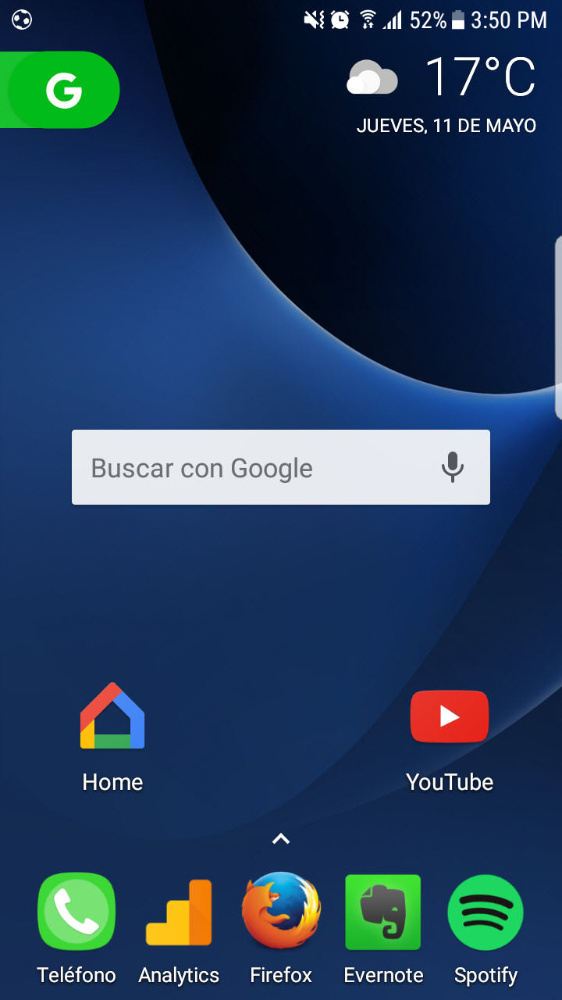

# Sistemas Operativos para Smartphone | Actividad 1: Sistemas operativos comunes y aplicaciones

_Origen: `sistemas_operativos_para_smartphone.html` del SCORM._

Sistemas Operativos para Smartphone | Actividad 1: Sistemas operativos comunes y aplicaciones 

document.body.className+=" js";jQuery(function(){loadPage()})

# Sistemas Operativos para Smartphone

Los **sistemas operativos móviles**son una de las tecnologías que más han evolucionado en los últimos años. Solo pensad en cómo eran los móviles hace 10 años y cómo son ahora: los cambios son gigantescos, y no ha sido así solo por el hardware, **el software ha tenido muchísimo que ver.**

Sistemas como **Android o iOS** son una maravilla, y en este punto los estudiaremos. ¡Vamos allá!

**Móviles de hace más de 10 años: en esa época no se podían considerar smartphones**

### **Apple iOS**

El sistema operativo **Apple iOS** es el usado en todos los móviles **iPhone**, además de versiones antiguas de **iPad**(ahora usan la variante **iPad OS**) y los **iPod Touch.**

****

**Logo de iOS**

                 

Este sistema **apareció por primera vez con el primer iPhone, lanzado en 2007**, si bien entonces se llamó simplemente «iPhone OS». **La característica más puntera de este sistema fue el soporte de la tecnología multitouch** que los demás fabricantes de smartphone acabarían adoptando años después. En general, iOS supuso una revolución que marcó el camino futuro de los smartphones. Aun así, **hay funciones que este sistema operativo móvil no tuvo desde el principio** y que ahora son imprescindibles, **como una tienda de aplicaciones**.

**Steve Jobs (fue cofundador y presidente ejecutivo de Apple)**

Cuando comenzó el desarrollo del iPhone por primera vez,**Steve Jobs**tenía en sus manos dos opciones: partir del sistema de los Mac (Mac OS) haciéndolo más pequeño, o partir del sistema de los iPod, haciéndolo más grande. Para decidirlo enfrentó a los equipos de Mac y iPod, y al final ganaron los primeros. Por ello, una curiosidad que muchos no saben es que **iOS está basado en Mac OS X**. **Tiene**, por tanto, **un núcleo (mayormente) Unix**.

## Vídeo: Historia de iOS

Mira este vídeo donde se explica **la historia de iOS**, junto a **las mejoras que ha ido incorporando sus distintas versiones** de este S.O. Más adelante se propone una actividad con lo que habrás aprendido en este vídeo:

## Actividad

**EJERCICIO 4: RELACIÓN 1**

**Realiza este ejercicio en tu libreta digital que has descargado desde la plataforma Web. Recuerda que más tarde el profesor puede preguntarte.**

**ANDROID**

**El gran competidor de iOS, sin lugar a dudas, es Android**. Estos dos son los sistemas operativos móviles más importantes de la historia y, sin ellos, el mundo de los smartphones estaría mucho más mermado.

**Logo del S.O. Android creado por la diseñadora Irina Block**

Es un **S.O. diseñado para su uso en tablets y dispositivos móviles de última generación conocidos como smartphones** o teléfonos inteligentes. Fue inicialmente diseñado por varias empresas entre las que se encontraba Google Inc. Finalmente **fue adquirido por Google** Inc.

Su liderazgo en los últimos años se debe en buena medida a que el **ecosistema de aplicaciones** es ya muy grande (eso hace que introducir un sistema operativo nuevo al mercado sea muy difícil). Pero también se debe a la **excelencia por parte de Apple y Google en su desarrollo**y al empeño por mejorarlos año a año y **competir por dar las mejores funcionalidades y la mayor seguridad.**¡Aprende, Microsoft!

**Tablet Android**  

 

Su **interfaz** es muy **intuitiva** y **se basa en el uso de pantallas táctiles** que alojan iconos en sus escritorios. Veamos un escritorio con varios iconos y un **widget** de búsqueda.

**Escritorio Android**

Tal y como se ha comentado antes, **la barra de Google es un «widget»** que funciona como la caja de búsqueda de Google en el navegador, pero que **se puede integrar directamente en la pantalla de inicio** para que puedas buscar más rápido en Internet. Muchos celulares ya incorporan de fábrica esta barra, pero si el tuyo no la trae, puedes **añadirla desde tu pantalla de widgets**.

## Actividad

**EJERCICIO 5: RELACIÓN 1**

**Realiza este ejercicio en tu libreta digital que has descargado desde la plataforma Web. Recuerda que más tarde el profesor puede preguntarte.**

[Creado con eXeLearning (Ventana nueva)](https://exelearning.net/)

