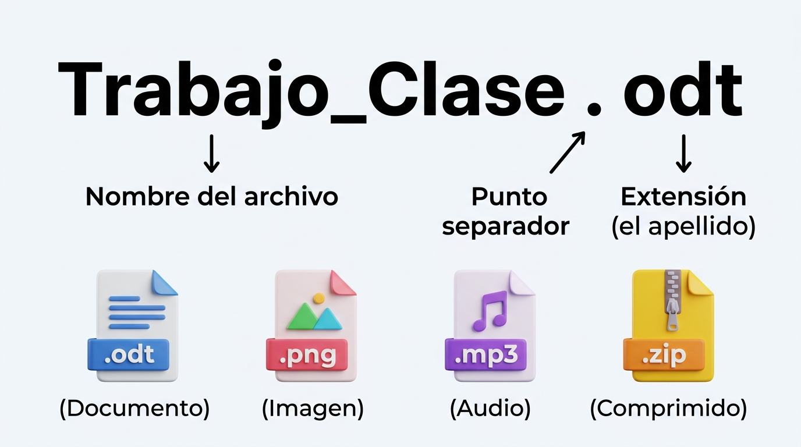
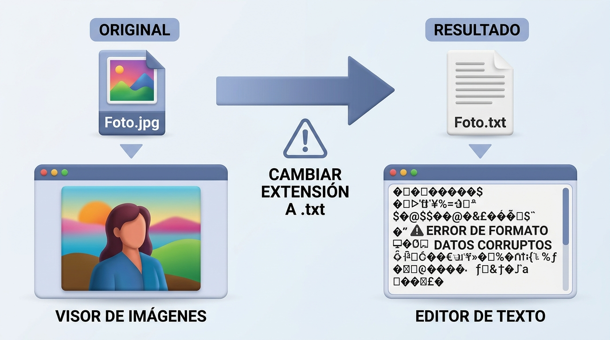
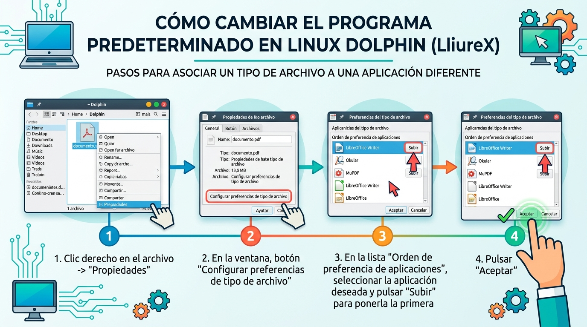

# Extensiones de archivo y programas asociados
<!--
{: .no_toc }

## Tabla de contenidos
{: .no_toc }

* TOC
{:toc}
-->

---

## 1. ¿Qué es la extensión de un archivo?

En un sistema operativo, el nombre completo de cualquier archivo informático está compuesto por **dos partes separadas por un punto (`.`)**:

$$\text{Nombre del archivo} = \text{Nombre propio} + \mathbf{.} + \mathbf{Extensión}$$

* **El nombre:** Es la primera parte y la elige libremente el usuario para describir el contenido (por ejemplo, `Trabajo_Historia`, `Foto_Excursion` o `Cancion_Favorita`).
* **La extensión:** Son las letras que aparecen **después del punto final** (por ejemplo, `.odt`, `.pdf`, `.jpg`, `.mp3` o `.txt`). 

> **La analogía del apellido:**  
> La extensión funciona exactamente como el **apellido** de una persona: le indica al ordenador de qué "familia" proviene ese archivo (si es un documento de texto, una fotografía, una canción, un vídeo o un paquete comprimido).
{: .alert-info}

{: .img .img-400}

**Anatomía del nombre completo de un archivo informático**
{: .centrado}

---

## 2. ¿Para qué sirve la extensión?

La extensión cumple tres funciones indispensables para el sistema operativo:

1. **Reconocer el tipo de información:** Permite al ordenador saber qué estructura de datos alberga el archivo sin necesidad de examinarlo por completo.
2. **Mostrar el icono visual adecuado:** Gracias a la extensión, Dolphin sabe si debe dibujar una página de texto, una nota musical, un fotograma de vídeo o una carpeta con cremallera.
3. **Asociar la aplicación predeterminada:** Cuando hacemos doble clic sobre un archivo, el sistema operativo lee su extensión y ejecuta inmediatamente el programa adecuado para abrirlo o reproducirlo.

---

## 3. Extensiones más comunes y sus programas en LliureX

En LliureX contamos con un amplio catálogo de aplicaciones educativas y de software libre. La siguiente tabla resume las extensiones más habituales con las que trabajarás a lo largo del curso:

| Tipo de contenido | Extensión | Programa predeterminado en LliureX | Descripción del formato |
| :--- | :---: | :--- | :--- |
| **Documento con formato** | **`.odt`** | **LibreOffice Writer** | Documentos de texto editables con estilos, tipografías, tablas e imágenes. |
| **Documento para lectura** | **`.pdf`** | **Okular** | Formato universal ideal para leer, imprimir o enviar tareas sin que se descoloque el diseño. |
| **Texto plano sin formato** | **`.txt`** | **KWrite** / **Kate** | Notas de texto sencillas sin negritas, fuentes especiales ni adornos. |
| **Imágenes y fotos** | **`.png`** / **`.jpg`** | **Gwenview** *(o GIMP para editar)* | Gráficos digitales y fotografías. `.png` permite fondos transparentes; `.jpg` comprime fotos. |
| **Audio y sonido** | **`.mp3`** / **`.ogg`** | **Reproductor VLC** | Canciones, audios grabados y podcasts. |
| **Vídeo y películas** | **`.mp4`** / **`.mkv`** | **Reproductor VLC** | Grabaciones audiovisuales con pista de imagen y sonido sincronizados. |
| **Archivo comprimido** | **`.zip`** / **`.tar.gz`**| **Ark** | Paquete que empaqueta y reduce el tamaño de varios archivos para enviarlos juntos. |
| **Archivo sin extensión** | *(Ninguna)* | *(Ninguno por defecto)* | Archivos dañados o cuyo "apellido" ha sido borrado por error; el sistema no sabe cómo abrirlos. |

---

## 4. ¿Qué ocurre si cambiamos o borramos la extensión?

> **¡Cuidado al renombrar!**  
> Si a una imagen llamada `Mascota.png` le cambias el nombre a `Mascota.txt`, **la imagen no se destruye**, pero el sistema operativo se desorienta por completo:
> - El icono cambiará de una fotografía a un folio de texto.
> - Al hacer doble clic, el ordenador intentará abrirla con el editor de textos KWrite en lugar del visor de fotos.
> - KWrite intentará interpretar los píxeles de color como si fuesen letras, mostrando en pantalla cientos de símbolos ilegibles e incoherentes.
>
> Por este motivo, al pulsar la tecla **`F2`** en Dolphin para renombrar un archivo, el sistema operativo selecciona automáticamente **únicamente el nombre**, dejando la extensión protegida.
{: .alert-warning}

{: .img .img-500}

**Consecuencias de cambiar la extensión a un archivo: error de formato y datos ilegibles**
{: .centrado}

---

### Actividad

> **EJERCICIO 9:** Realiza este ejercicio en tu libreta digital que has descargado desde la plataforma Web. Recuerda que más tarde el profesor puede preguntarte.
{: .alert-success}

---

## 5. Cambiar el programa predeterminado asociado a una extensión

En muchas ocasiones nos interesa que un tipo de archivo se abra por defecto con una aplicación diferente a la configurada inicialmente en el sistema. Por ejemplo, podemos preferir que los archivos de texto `.txt` se abran siempre con el editor **Kate** en lugar de **KWrite**, o que las imágenes se abran directamente con un programa de dibujo como **KolourPaint** o **GIMP**.

En LliureX y el explorador Dolphin podemos cambiar esta asociación de forma permanente siguiendo estos pasos:

1. **Haz clic derecho** sobre un archivo que tenga la extensión que deseas configurar (por ejemplo, un archivo `.txt` o `.png`).
2. En el menú contextual, selecciona **Propiedades** (o pulsa el atajo `Alt + Enter`).
3. En la pestaña **General**, pulsa sobre el botón **[Configurar las preferencias de tipo de archivo...]** (a la derecha del tipo de archivo).
4. En la ventana que aparece, observa la lista **Orden de preferencia de aplicaciones**:
   - Localiza la aplicación que deseas utilizar por defecto.
   - Pulsa el botón **Subir** repetidamente hasta colocarla en la **primera posición** de la lista.
   - *(Si la aplicación deseada no aparece en la lista, pulsa el botón **Añadir...** para buscarla en el catálogo de LliureX).*
5. Pulsa el botón **Aplicar** y después **Aceptar**.

A partir de ese momento, cada vez que hagas doble clic sobre cualquier archivo con esa misma extensión, se abrirá automáticamente con el nuevo programa seleccionado.

{: .img .img-500}

**Pasos para cambiar la aplicación predeterminada asociada a una extensión en Dolphin (LliureX)**
{: .centrado}

### Actividad

> **EJERCICIO 10:** Realiza este ejercicio en tu libreta digital que has descargado desde la plataforma Web. Recuerda que más tarde el profesor puede preguntarte.
{: .alert-success}

---

[👈 Atrás](./operaciones_basicas)
[👉 Siguiente](./ejercicios_de_repaso)
