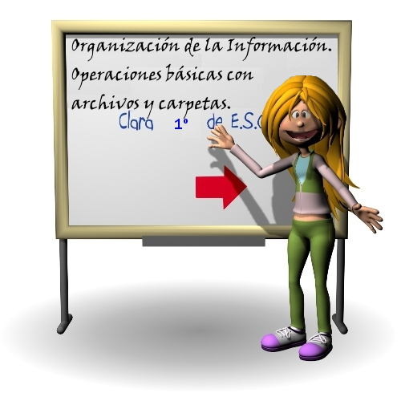

# Actividad 2: Organización de la información. Operaciones básicas con archivos y carpetas

**Internet es una red abierta** y, por lo tanto, una herramienta muy popular. En la actualidad, **no solo los ordenadores y los dispositivos móviles tienen conexión a Internet**: la sociedad parece avanzar hacia el Internet de las cosas, lo que significa que **cualquier objeto puede estar conectado a la red**.  
Esto implica que sea **necesario seguir una serie de normas de seguridad**, con el objetivo de garantizar que la información que millones de personas  hacemos circular en la red está bajo control. 

En esta sesión estudiaremos las los siguientes puntos:

1. **Organización de la información:** En este primer punto de esta sesión, veremos qué es un fichero y una carpeta. Además, veremos la forma de acceder a ficheros y carpetas desde LliureX mediante el explorador Dolphin así como el entorno de trabajo de este explorador.
2. **Operaciones básicas con carpetas:** En este punto veremos las operaciones que podemos hacer con carpetas desde las diferentes opciones de LliureX.
3. **Operaciones básicas con archivos:** Veremos las operaciones que podemos hacer con archivos desde las diferentes opciones de LliureX.

  

[👈 Atrás](./index)
[👉 Siguiente](./organizacin_de_la_informacin)