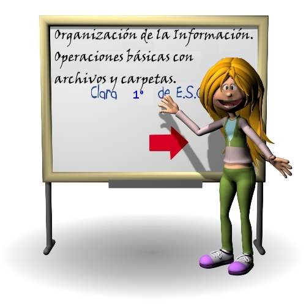

# Actividad 2: Organización de la información. Operaciones básicas con archivos y carpetas

**Internet es una red abierta** y, por lo tanto, una herramienta muy popular. En la actualidad, **no solo los ordenadores y los dispositivos móviles tienen conexión a Internet**: la sociedad parece avanzar hacia el Internet de las cosas, lo que significa que **cualquier objeto puede estar conectado a la red**.  
Esto implica que sea **necesario seguir una serie de normas de seguridad**, con el objetivo de garantizar que la información que millones de personas  hacemos circular en la red está bajo control. 

En esta sesión estudiaremos los siguientes puntos:

1. **Organización de la información:** Veremos qué es un fichero y una carpeta, los soportes de almacenamiento, las rutas y el entorno del explorador Dolphin.
2. **Operaciones básicas con archivos y carpetas:** Aprenderemos a seleccionar, crear, abrir, mover, copiar, renombrar y eliminar elementos (y rescatarlos de la papelera).
3. **Extensiones de archivo:** Analizaremos qué son las extensiones, cómo asocian los programas en LliureX y la importancia de no alterarlas.
4. **Ejercicios de repaso:** Reto final con sopa de letras interactiva y chuleta digital de atajos.

> ⚡ **Recurso de consulta rápida:** Puedes tener a mano durante todas las sesiones la guía de [Atajos de Teclado para el Sistema de Archivos](./atajos_teclado).
{: .alert-info}

  

[👈 Atrás](./index)
[👉 Siguiente](./organizacin_de_la_informacin)