# Operaciones básicas con archivos y carpetas
<!--
{: .no_toc }

## Tabla de contenidos
{: .no_toc }

* TOC
{:toc}

-->

La información en un sistema operativo se almacena en **ficheros** (archivos) y se organiza en **carpetas** (directorios). Todos ellos residen en algún **soporte de almacenamiento** (disco duro interno, unidad SSD, memoria USB o la nube).

En el explorador de archivos **Dolphin**, la inmensa mayoría de las operaciones de gestión (**crear, mover, copiar, renombrar, seleccionar y eliminar**) se realizan exactamente de la misma manera tanto si estamos trabajando con carpetas como si lo hacemos con archivos individuales.

A continuación, aprenderemos a dominar cada una de estas operaciones esenciales.

---

## 1. Crear elementos: Carpetas vs. Archivos

Esta es la **principal diferencia práctica** entre archivos y carpetas: las carpetas se crean directamente dentro del explorador como contenedores organizativos, mientras que los archivos suelen crearse desde los programas al guardar un trabajo.

### a) Crear una carpeta nueva en Dolphin
Para crear una nueva carpeta donde clasificar documentos:
1. Abre Dolphin y navega hasta la carpeta donde quieras crear la nueva (por ejemplo, en `Documentos`).
2. Tienes dos formas rápidas de hacerlo:
   - **Con el menú contextual:** Haz clic derecho en un espacio vacío y selecciona **Crear nuevo > Carpeta...**.
   - **Con el atajo de teclado:** Pulsa la tecla rápida **`F10`**.
3. Escribe el nombre de la carpeta y pulsa la tecla **`Enter`**.

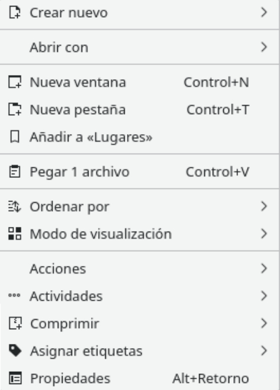
{: .img}

**Crear una carpeta mediante el Menú contextual en Dolphin**
{: .centrado}

#### Vídeo: Crear Carpetas

[👉 Ver el vídeo](https://youtu.be/B6efNm84rjc?si=yhUcYW1wAUmVLBGm)

### b) Crear un archivo (Guardar desde una aplicación)
Los archivos de datos no se suelen crear vacíos en Dolphin; se originan en las distintas aplicaciones (un documento de texto en **LibreOffice Writer** o **KWrite**, un dibujo en **GIMP** o **KolourPaint**, etc.):
1. Al terminar o avanzar en tu trabajo dentro del programa, pulsa en el menú superior **Archivo > Guardar** (o **Guardar como...**).
2. En la ventana emergente, selecciona la carpeta de destino donde quieres almacenarlo.
3. Escribe el nombre deseado para el archivo y pulsa **Guardar**.

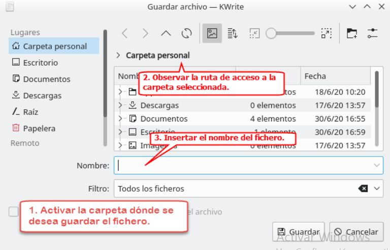
{: .img}

**Ventana Guardar como... desde la aplicación KWrite**
{: .centrado}

#### Vídeo: Crear y guardar ficheros

[👉 Ver el vídeo](https://www.youtube.com/watch?v=4b2xtd9MdiY)

#### Actividad

> **EJERCICIO 5:** Realiza este ejercicio en tu libreta digital que has descargado desde la plataforma Web. Recuerda que más tarde el profesor puede preguntarte.
{: .alert-success}

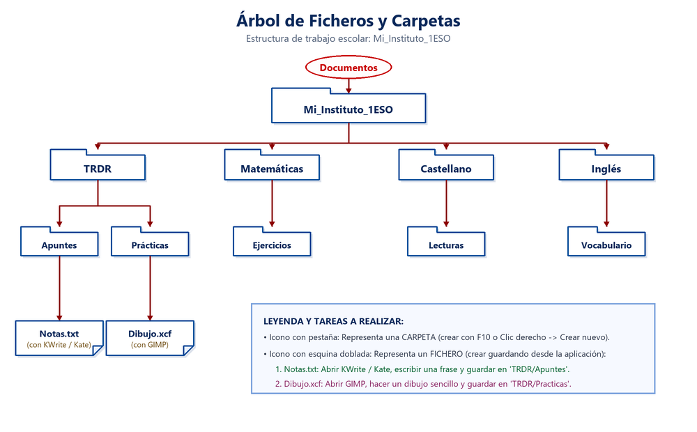
{: .img}

**Estructura del árbol de carpetas y ficheros para el Ejercicio 5**
{: .centrado}

---

## 2. Mover vs. Copiar (Trasladar vs. Duplicar)

Es imprescindible distinguir entre estas dos operaciones para evitar pérdidas de archivos o copias duplicadas innecesarias:

> [!IMPORTANT]
> - **Copiar (`Ctrl + C` -> `Ctrl + V`):** Crea un **duplicado exacto**. El elemento original **permanece en su lugar de origen** y aparece una copia en la carpeta de destino.
> - **Mover (`Ctrl + X` -> `Ctrl + V` o arrastrar):** **Traslada** el elemento. Desaparece de la carpeta de origen y se reubica únicamente en la carpeta de destino.
>
> *Nota:* Al mover o copiar una carpeta, **todas las subcarpetas y archivos que contiene en su interior viajan con ella**.

### Pasos para Mover (Cortar y Pegar):
1. Selecciona el archivo o carpeta (o varios con `Ctrl` / `Shift`).
2. Pulsa **`Ctrl + X`** (o clic derecho > **Cortar**). El icono se mostrará ligeramente translúcido.
3. Navega a la carpeta de destino.
4. Pulsa **`Ctrl + V`** (o clic derecho en un espacio vacío > **Pegar**).

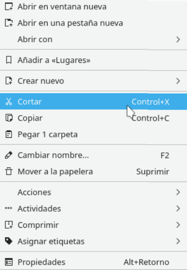
{: .img}

**Opción Cortar del menú contextual**
{: .centrado}

### Pasos para Copiar (Copiar y Pegar):
1. Selecciona el archivo o carpeta.
2. Pulsa **`Ctrl + C`** (o clic derecho > **Copiar**).
3. Navega a la carpeta de destino.
4. Pulsa **`Ctrl + V`** (o clic derecho en un espacio vacío > **Pegar**).

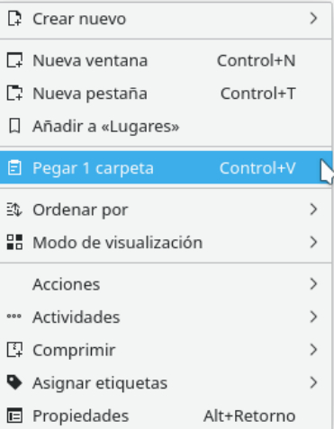
{: .img}

**Opción Pegar en la carpeta de destino**
{: .centrado}

### Mover o copiar arrastrando con el ratón
También puedes arrastrar los elementos seleccionados de una carpeta a otra. Al soltarlos, Dolphin te mostrará un menú preguntándote: **¿Mover aquí o Copiar aquí?**, permitiéndote elegir la acción al instante.

#### Vídeos de apoyo:
- [👉 Vídeo: Mover elementos](https://www.youtube.com/watch?v=XYDkf5vJOjM)
- [👉 Vídeo: Copiar elementos](https://www.youtube.com/watch?v=M3acj4sLwlE)

#### Actividad

> **EJERCICIO 6:** Realiza este ejercicio en tu libreta digital que has descargado desde la plataforma Web. Recuerda que más tarde el profesor puede preguntarte.
{: .alert-success}

---

## 3. Renombrar elementos (Atajo rápido `F2`)

Cuando necesites corregir faltas ortográficas o poner un nombre más claro a un archivo o carpeta:

1. Selecciona el elemento y pulsa la tecla rápida **`F2`** (o haz clic derecho > **Cambiar nombre...**).
2. El nombre quedará en modo edición:
   - **En carpetas:** Se selecciona todo el nombre.
   - **En archivos:** Dolphin selecciona de forma inteligente **únicamente el nombre**, dejando sin tocar el punto y la extensión (`.txt`, `.odt`, `.jpg`...). Esto se hace para evitar que borres la extensión por error.
3. Teclea el nuevo nombre y pulsa **`Enter`** para guardar los cambios (o la tecla `Esc` para cancelar).

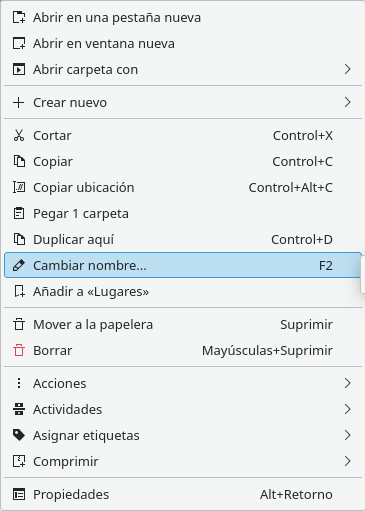
{: .img}

**Opción Cambiar nombre en el menú contextual**
{: .centrado}

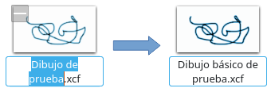
{: .img}

**Edición del nombre sin alterar la extensión**
{: .centrado}

#### Vídeo: Renombrar en LliureX

[👉 Ver el vídeo](https://www.youtube.com/watch?v=EL2lSZZptQs)

#### Actividad

> **EJERCICIO 7:** Realiza este ejercicio en tu libreta digital que has descargado desde la plataforma Web. Recuerda que más tarde el profesor puede preguntarte.
{: .alert-success}

---

## 4. Seleccionar elementos (Archivos y Carpetas)

Antes de aplicar cualquier acción (copiar, mover, borrar...) a uno o varios elementos, primero debemos **seleccionarlos**. Dolphin ofrece diferentes métodos según nuestras necesidades:

### a) Seleccionar un solo elemento
1. Haz **un solo clic** con el botón izquierdo del ratón sobre el icono o nombre del archivo o carpeta.
2. El elemento quedará resaltado en color azul, indicando que está activo.

### b) Selección continua en bloque (`Shift + Clic` o recuadro)
Cuando queremos seleccionar varios elementos que están juntos o consecutivos:
* **Método con teclado (`Shift + Clic`):** Haz clic en el primer elemento de la lista, mantén pulsada la tecla **`Shift` (Mayús)** y haz clic en el último elemento. Todos los archivos y carpetas intermedios quedarán seleccionados de golpe.
* **Método del recuadro con el ratón:** Haz clic en una zona vacía de la ventana y, sin soltar el botón izquierdo, arrastra el puntero para dibujar un rectángulo sobre los elementos deseados. Todos los que queden tocados se seleccionarán.

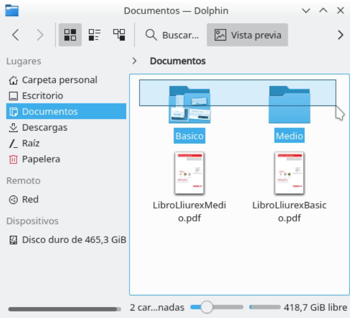
{: .img .img-400}

**Seleccionar varios elementos por recuadro con el ratón**
{: .centrado}

### c) Selección discontinua salteada (`Ctrl + Clic`)
Cuando los elementos que nos interesan están separados entre sí:
1. Haz clic en el primer archivo o carpeta.
2. Mantén pulsada la tecla **`Ctrl`** y haz clic sobre cada uno de los elementos adicionales que quieras sumar a la selección.
3. Si haces clic sobre un elemento ya seleccionado mientras mantienes `Ctrl`, este se deseleccionará individualmente.

### d) Seleccionar TODOS los elementos (`Ctrl + A`)
Si deseas seleccionar absolutamente todo el contenido de la carpeta activa de una sola vez, pulsa la combinación de teclas **`Ctrl + A`**.

### e) Quitar la selección
Para deseleccionar todo y volver al estado inicial, haz un solo clic en cualquier **espacio vacío** de la ventana de Dolphin.

#### Vídeo: Seleccionar elementos en Dolphin

[👉 Ver el vídeo](https://youtu.be/HQEJHSfWbFQ?si=g2n-w4jehO8NB16t)

#### Actividad

> **EJERCICIO 8:** Realiza este ejercicio en tu libreta digital que has descargado desde la plataforma Web. Recuerda que más tarde el profesor puede preguntarte.
{: .alert-success}

---

## 5. Abrir archivos y carpetas

* **Abrir una carpeta:** Al hacer doble clic sobre una carpeta, entramos a su interior, mostrándose los archivos y subcarpetas que contiene en la vista principal.
* **Abrir un archivo:** Al hacer doble clic sobre un archivo, el sistema operativo consulta su extensión y abre automáticamente la aplicación predeterminada asociada (por ejemplo, una imagen se abrirá en Gwenview y un PDF en Okular).
* **Abrir con otra aplicación:** Si deseas abrir un archivo con un programa diferente al habitual, haz clic derecho sobre él y elige **Abrir con...**, seleccionando la aplicación deseada de la lista.

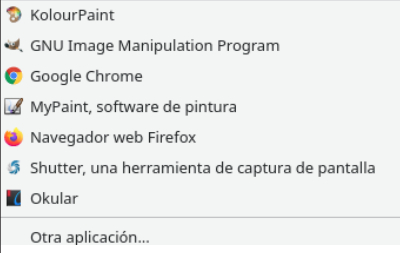
{: .img}

**Menú contextual: Abrir con otra aplicación**
{: .centrado}

#### Vídeo: Abrir un archivo

[👉 Ver el vídeo](https://www.youtube.com/watch?v=MnOz_b7RhUE)

---

## 6. Eliminar y Recuperar (La Papelera de reciclaje)

Cuando un archivo o carpeta ya no es necesario, podemos eliminarlo. LliureX ofrece dos niveles de borrado:

### a) Mover a la Papelera (`Supr`) - Seguro y recuperable
1. Selecciona el archivo o carpeta y pulsa la tecla **`Supr`** (Delete), o haz clic derecho > **Mover a la papelera**.
2. El elemento desaparece de su ubicación actual y se guarda en la **Papelera de reciclaje**. Si lo has borrado por error, se puede recuperar.

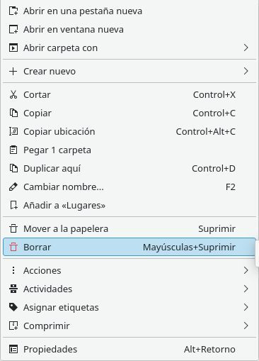
{: .img}

> [!WARNING]
> **¡Atención en equipos del instituto!** En el aula de informática, los archivos guardados en la carpeta `Documentos` a menudo se almacenan físicamente en el servidor de centro. En algunas configuraciones de red, los archivos de servidor pueden borrarse directamente sin pasar por la papelera local. ¡Pregunta a tu profesor/a si tienes dudas!

### b) Borrado definitivo (`Shift + Supr`) - Irreversible
Si pulsas la combinación de teclas **`Shift + Supr`** (Mayús + Supr), el archivo o carpeta **se eliminará permanentemente** sin pasar por la papelera. Dolphin mostrará una ventana de advertencia pidiendo confirmación. Ten máxima precaución: **esta acción no se puede deshacer**.

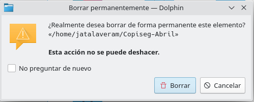
{: .img}

**Advertencia de eliminación permanente irreversible**
{: .centrado}

> [!TIP]
> **Activar la opción "Borrar" en el menú contextual de Dolphin:**  
> Si quieres que en el menú del botón derecho aparezca siempre la opción directa *Borrar* junto a *Mover a la papelera*, entra en el botón **Control** de Dolphin (icono de tres barras o rueda superior) > **Configurar > Configurar Dolphin...** > apartado **Menú de contexto** y marca la casilla **Borrar**.
>
> 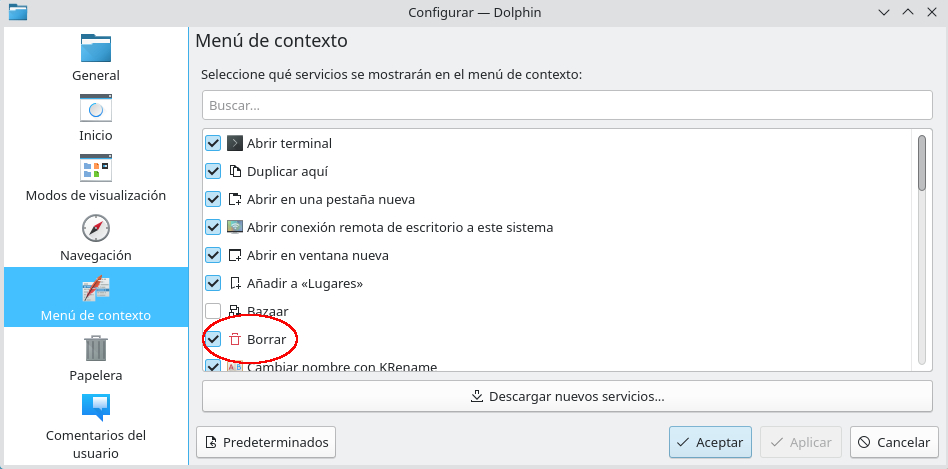
> {: .img}

### c) Recuperar un archivo o carpeta de la Papelera
Si te has arrepentido de eliminar un elemento:
1. En el panel izquierdo de Dolphin (panel Lugares), pulsa sobre **Papelera**.
2. Localiza el archivo o carpeta que eliminaste.
3. Haz clic derecho sobre él y elige la opción **Restaurar**.
4. El elemento volverá de forma automática a la misma carpeta donde se encontraba originalmente.

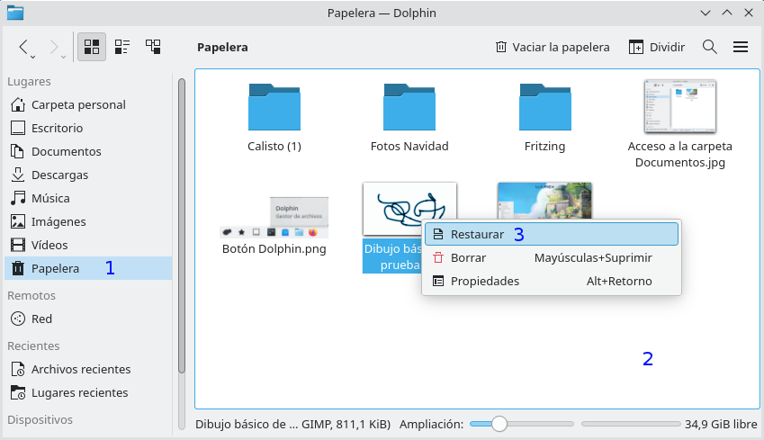
{: .img}

**Restaurar elementos desde la Papelera de reciclaje**
{: .centrado}

#### Vídeos de apoyo:
- [👉 Vídeo: Eliminar elementos](https://www.youtube.com/watch?v=t41vBWu3qhI)
- [👉 Vídeo: Restaurar desde la Papelera](https://www.youtube.com/watch?v=ont4V2al_Yo)

#### Actividad

> **EJERCICIO 11:** Realiza este ejercicio en tu libreta digital que has descargado desde la plataforma Web. Recuerda que más tarde el profesor puede preguntarte.
{: .alert-success}

---

[👈 Atrás](./organizacin_de_la_informacin)
[👉 Siguiente](./extensiones)
