# Operaciones básicas con archivos
{: .no_toc }

## Tabla de contenidos
{: .no_toc }

* TOC
{:toc}

## Operaciones con ficheros

Los **ficheros** son **creados por las diferentes aplicaciones**. Cada aplicación permite al usuario crear un “tipo” de trabajos: el **KWrite para crear****documentos**, el **KolourPaint para realizar dibujos**, etc  
En éste punto, se van a **estudiar las principales operaciones** de Gestión -también llamadas operaciones Básicas- **que se realizan sobre los ficheros**. Dichas operaciones son:

1. Seleccionar.
2. Crear.
3. Abrir.
4. Mover.
5. Copiar.
6. Renombrar.
7. Eliminar.
8. Recuperar.

A continuación veremos **cómo realizar cada una de estas operaciones con ficheros** haciendo uso del **explorador de ficheros Dolphin**:

### 1. SELECCIONAR FICHEROS

Esta operación permite **seleccionar uno o más ficheros** sobre los cuales aplicar una misma operación (eliminar, mover, copiar,....).

a) **Seleccionar un Fichero:**

1. **Pulsar** sobre el **botón [Dolphin]** del **panel [Gestión]** para abrir la ventana del explorador.  
2. **Activar** la **carpeta-madre** del fichero a seleccionar.  
3. **Pulsar** sobre el **icono del fichero** a seleccionar.

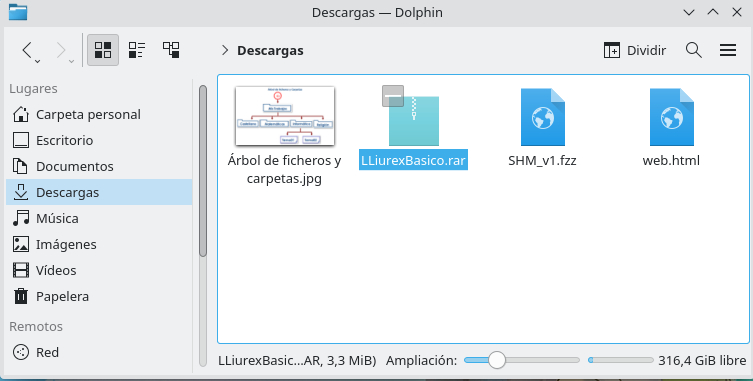
{: .img}

**Selección de un fichero llamado LliurexBasico.rar**
{: .centrado}

b) **Seleccionar varios Ficheros:** 

b1. **Utilizando** la tecla [**Ctrl**]:

1. **Pulsar** en **el primero de los ficheros** a seleccionar.  
2. **Pulsar [Ctrl]** **mientras se pulsa sobre el resto** de iconos.

En este caso, hay que tener en cuenta las siguientes **consideraciones**:

- **Si [Ctrl] no está pulsada**, al pulsar sobre un fichero, es seleccionado y, el resto de ficheros, deseleccionado.  
- **Si [Ctrl] está pulsada**, al pulsar sobre un fichero seleccionado, se deselecciona.

b2. **Sin utilizar** la tecla [**Ctrl**] (solo el puntero del ratón):

1. Alternativamente, **pulsar (botón izquierdo del ratón) y arrastrar en el área [Ficheros y Carpetas]** para dibujar un recuadro.  
2. Todos **los ficheros “tocados”** por el recuadro son **seleccionados**.

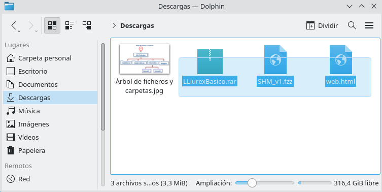
{: .img}

**Selección de varios ficheros utilizando el puntero del ratón.**
{: .centrado}

c) **Quitar la Selección:**

1. **Pulsar** sobre **un área vacía**.

#### Vídeo: Seleccionar Ficheros

Si los pasos anteriores no te han quedado claros, visualiza este vídeo para aprender a **seleccionar Ficheros en LliureX**:

[👉 Vídeo](https://www.youtube.com/watch?v=gf6QsIlSCnY)

### 2. CREAR FICHEROS

**La creación de ficheros tiene lugar****cuando se guarda el trabajo.** La forma de guardarlo **depende de la****aplicación utilizada**, sin embargo, la mayoría sigue el mismo proceso:

**Crear un Fichero:** Los pasos a realizar son los siguientes:

1. **Seleccionar** la opción de menú [**Archivo> Guardar**].  
2. Se muestra el **cuadro de diálogo [Guardar como]**:

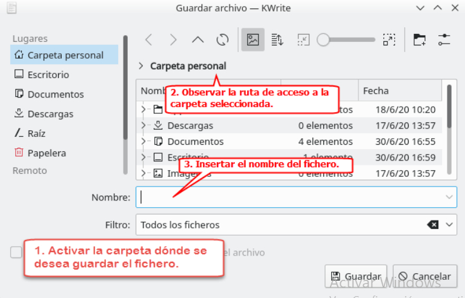
{: .img}

**La figura muestra el cuadro de la aplicación KWrite.**
{: .img}

3. **Seleccionar**, en primer lugar, **la carpeta dónde se desea****guardar y**, por último, **asignar****el nombre al fichero**.
{:start="2"}

#### Vídeo: Crear Ficheros

Si los pasos anteriores no te han quedado claros, visualiza este vídeo para aprender a **crear Ficheros en LliureX**:

[👉 Vídeo](https://www.youtube.com/watch?v=4b2xtd9MdiY)

#### Actividad

> **EJERCICIOS 33 y 34:** Realiza estos ejercicios en tu libreta digital que has descargado desde la plataforma Web. Recuerda que más tarde el profesor puede preguntarte.**
{: .alert-success}

### 3. ABRIR UN FICHERO

Los ficheros contienen información (texto, imágenes, audio,...). La **operación abrir permite al usuario escuchar o ver su contenido**.

**Abrir un Fichero:** Los pasos a realizar son:

1. Hacer **doble clic sobre el fichero**.  
2. **Emerge una ventana**, en cuyo interior se ejecuta una aplicación capaz de mostrar el contenido del fichero. **En la barra [Título] de la ventana se muestra el****nombre de la aplicación abierta**. A veces, la aplicación es la misma que la utilizada para crear el fichero, pero no siempre. Para **abrir el fichero con una aplicación diferente**:

3. **Desplegar** el menú [**Contextual del fichero> Abrir con...**]:

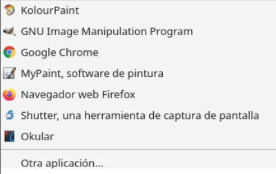
{: .img}

**Menú Abrir con... (las entradas de este menú dependerán del tipo de fichero).**
{: .img}

#### Vídeo: Abrir un Fichero

Si los pasos anteriores no te han quedado claros, visualiza este vídeo para aprender a **crear Ficheros en LliureX**:

[👉 Vídeo](https://www.youtube.com/watch?v=MnOz_b7RhUE)

### 4. MOVER FICHEROS
La operación mover **consiste** -como su nombre indica- **en desplazar un fichero/s de una a otra carpeta**.

**Mover un Fichero:** Ésta técnica se denomina **Cortar y Pegar**:

1. **Abrir el explorador de ficheros** y **activar la carpeta-madre** o fuente **que contiene el fichero**.  
2. **Seleccionar** el **fichero**.  
3. **Desplegar** el menú [**Contextual de la selección> Cortar**].  
4. **Activar** la **carpeta-destino**.  
5. **Desplegar** el menú [**Contextual del área de Ficheros y Carpetas> Pegar**]

#### Vídeo: Mover Ficheros

Si los pasos anteriores no te han quedado claros, visualiza este vídeo para aprender a**mover Ficheros en LliureX**:

[👉 Vídeo](https://www.youtube.com/watch?v=K-bH2PFTFO8)

#### Actividad

> **EJERCICIO 35:** Realiza este ejercicio en tu libreta digital que has descargado desde la plataforma Web. Recuerda que más tarde el profesor puede preguntarte.**
{: .alert-success}

### 5. COPIAR FICHEROS
La operación copiar consiste -como su nombre indica- en **realizar una****copia de un fichero de una carpeta a otra**:

**Copiar un Fichero:** Ésta técnica se denomina **Cortar y Pegar**:

1. **Abrir** el explorador de ficheros **Dolphin**.  
2. **Activar** la **carpeta-madre** o fuente **que contiene el fichero**.  
3. **Seleccionar** el **fichero**.  
4. **Desplegar** el menú [**Contextual de la selección> Copiar**]  
5. **Activar** la **carpeta-destino**.  
6. **Desplegar** el menú [**Contextual del área de Ficheros y Carpetas>****Pegar**]

#### Vídeo: Copiar Ficheros

Si los pasos anteriores no te han quedado claros, visualiza este vídeo para aprender a **copiar Ficheros en LliureX**:

[👉 Vídeo](https://www.youtube.com/watch?v=1EAGePFQvIQ)

#### Actividad

> **EJERCICIO 36:** Realiza este ejercicio en tu libreta digital que has descargado desde la plataforma Web. Recuerda que más tarde el profesor puede preguntarte.**
{: .alert-success}

### 6. RENOMBRAR UN FICHERO

**Cambiar el nombre de un Fichero:** Los pasos a realizar son:

1. **Desplegar** el menú [**Contextual del fichero a cambiar el nombre>****Cambiar nombre...**]  
2. **El nombre queda resaltado** a la espera del nuevo nombre:

**NOTA:** Cuando el **texto** aparece **resaltado**, si se pulsa una tecla **toda la selección es sustituida por la tecla pulsada**:
  
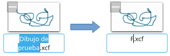
{: .img}

**Resultado de pulsar la tecla F con el nombre del archivo resaltado**
{: .centrado}

Sin embargo, si se desea **cambiar algunas letras** es preferible **pulsar encima y editarlo**. De ésta forma el nombre permanece y el usuario puede sustituir únicamente las letras deseadas:

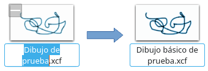
{: .img}

**Cambiando únicamente una parte del nombre del fichero**
{: .centrado}

3. Cambiar el nombre y **pulsar la tecla [Enter]** **para aceptar los cambios**.
{:start="3"}

#### Vídeo: Renombrar un Fichero

Si los pasos anteriores no te han quedado claros, visualiza este vídeo para aprender a **renombrar Ficheros en LliureX**:

[👉 Vídeo](https://www.youtube.com/watch?v=1Rs9V0hETdM)

#### Actividad

> **EJERCICIO 37:** Realiza este ejercicio en tu libreta digital que has descargado desde la plataforma Web. Recuerda que más tarde el profesor puede preguntarte.**
{: .alert-success}

**7. ELIMINAR UN FICHERO**  
La operación eliminar un archivo **es igual a Eliminar Carpetas.**

**Eliminar un Fichero:** Los pasos a realizar son:

1. **Desplegar** el menú [**Contextual del Fichero a eliminar**]:
  
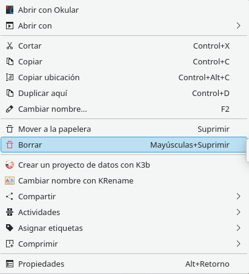
{: .img}

**Entrada Borrar y Mover a la Papelera del menú contextual**
{: .centrado}

2. Existen **dos entradas que eliminan** el fichero:
{:start="2"}

a) **[Mover a la Papelera]: Elimina el fichero y lo deposita en la [Papelera]**. Es equivalente a pulsar [**Supr**]:  

> ¡Atención! Cuando el ordenador del usuario está conectado a un servidor (como es el caso de nuestros equipos de clase), los objetos (carpetas y ficheros) almacenados en la carpeta **Documentos** físicamente se guardan en el disco duro del servidor. **En éste caso, al eliminar un objeto de la carpeta Documentos no se envía a la Papelera para algunas versiones de LliureX**.  
{: .alert-warning}

b)**[Borrar]: Elimina el fichero (es imposible recuperarlo)** por éste motivo muestra un mensaje de advertencia antes de proceder:

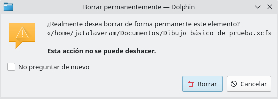
{: .img}

**Mensaje de advertencia al Borrar el archivo Dibujo básico de prueba.xcf mediante la opción [Borrar] del menú contextual.**
{: .centrado}

> **¡Atención!** A veces **la entrada [Borrar] aparece desactivada** en el menú contextual (es decir, no aparece). Para visualizarla se debe:
{: .alert-warning}

1. **Pulsar** el botón [**Control**] del explorador Dolphin:

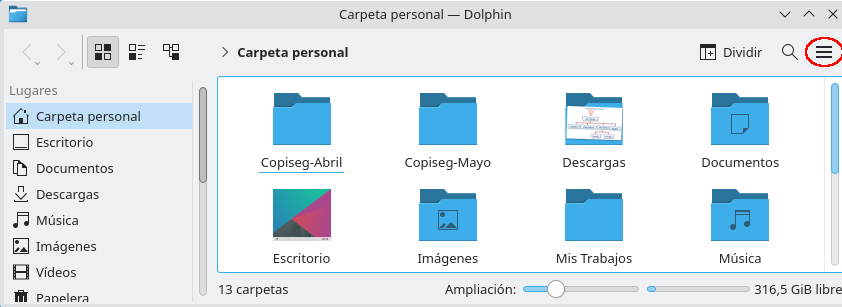
{: .img}

**Botón Control (circulo rojo) del explorador Dolphin.**
{: .centrado}

2. **Seleccionar** la entrada [**Configurar > Configurar Dolphin...**]:
{:start="2"}

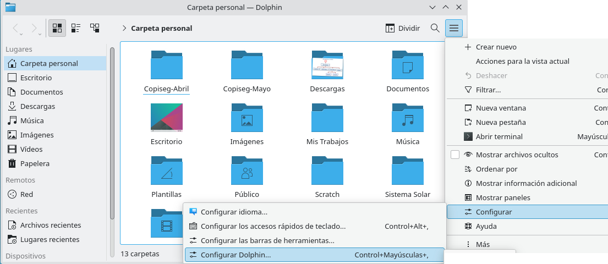
{: .img}

**Entrada Configurar  > Configurar Dolphin...**
{: .centrado}

3. Una vez se ha abierto el cuadro [Dolphin],**activamos el botón "Menú de Contexto"** (circulo rojo de la figura siguiente):
{:start="3"}

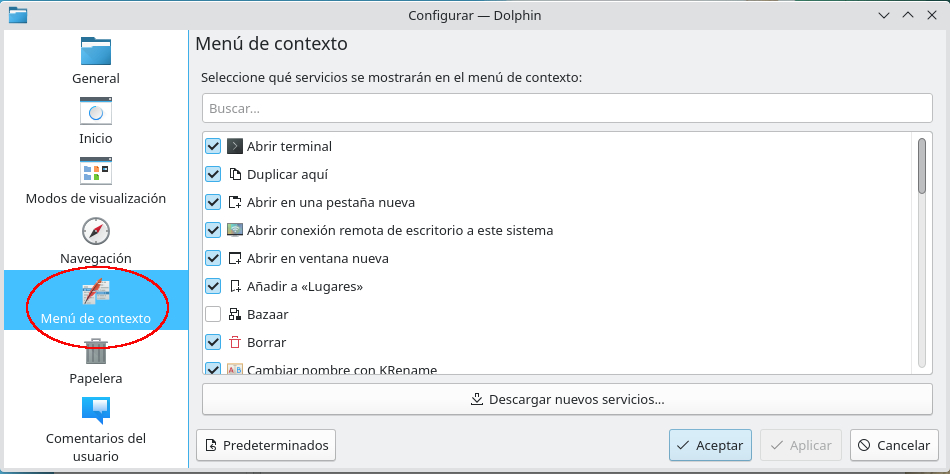
{: .img}

4. **Activamos** la casilla [**Borrar**] (circulo rojo de la imagen siguiente) y **pulsamos** el botón [**Aceptar**]:
{:start="4"}

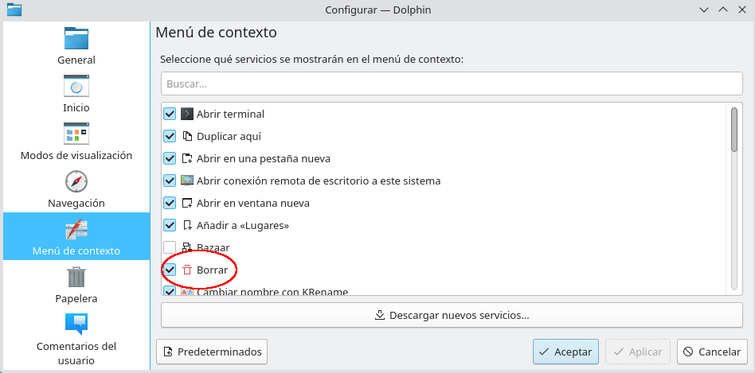
{: .img}

#### Vídeo: Eliminar un Fichero

Si los pasos anteriores no te han quedado claros, visualiza este vídeo para aprender a **eliminar Ficheros en LliureX**:

[👉 Vídeo](https://www.youtube.com/watch?v=okohsAnQxzk)

#### Actividad

> **EJERCICIO 38:** Realiza este ejercicio en tu libreta digital que has descargado desde la plataforma Web. Recuerda que más tarde el profesor puede preguntarte.**
{: .alert-success}

### 8. RECUPERAR UN FICHERO
Los ficheros “**movidos a la Papelera**”, en caso de arrepentimiento, se pueden recuperar.

**Recuperar un Fichero de la Papelera:** Los pasos son los siguientes:

{: .img}

1.**Abrir** el explorador de ficheros**Dophin**.

2.**Pulsar** en **la entrada [Papelera]** del panel [Lugares] (**número 1** de la imagen).

3.En el **área [Contenidos]** se muestran los últimos **ficheros eliminados** (**número 2**).

4.**Desplegar** el menú [**Contextual del Fichero a recuperar> Restaurar**] (**número 3**)

5.El fichero aparece en su lugar de origen.

#### Vídeo: Recuperar un fichero

Si los pasos anteriores no te han quedado claros, visualiza este vídeo para aprender a**recuperar Ficheros en LliureX**:

[👉 Vídeo](https://www.youtube.com/watch?v=DREXVxd6vSE)

[👈 Atrás](./operaciones_bsicas_con_carpetas)
[👉 Siguiente](./ejercicios_de_repaso)

