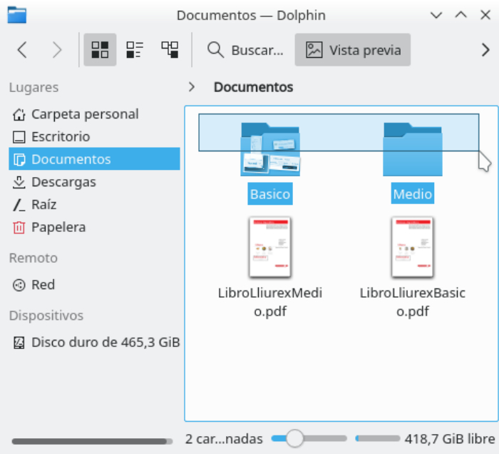
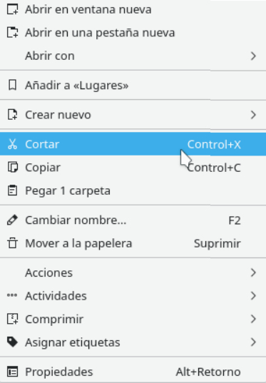
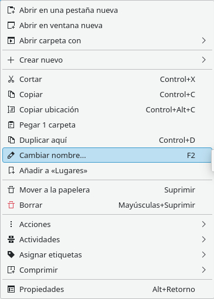
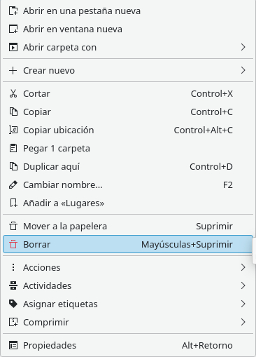
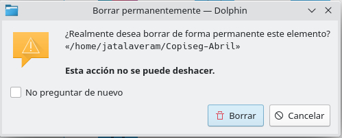

# Operaciones básicas con carpetas
{: .no_toc }

## Tabla de contenidos
{: .no_toc }

* TOC
{:toc}

Tal y como ya hemos visto en el punto anterior, la **información** se empaqueta **en ficheros** y para organizar los ficheros se utilizan **las carpetas**. La información (ficheros y carpetas) son soportados por los diferentes **sistemas de Almacenamiento**. El **principal****soporte** o sistema **de almacenamiento** es el **disco duro** situado en el interior de la carcasa que cubre la Unidad Central del ordenador.
  
## Operaciones con carpetas

**Los ficheros son** creados **para almacenar los trabajos del usuario**. Con el tiempo, el número de ficheros se incrementa y es necesario utilizar algún **sistema de organización para facilitar su “gestión”**, en éste punto es dónde aparecen **las carpetas**.  
En este punto, se estudian una serie de **operaciones que afectan****a las carpetas**. Dichas operaciones son:
  
1. Seleccionar.  
2. Crear.  
3. Mover.  
4. Copiar.  
5. Renombrar.  
6. Eliminar.  
7. Recuperar.
  
A continuación veremos **cómo realizar cada una de estas operaciones con carpetas** haciendo uso del **explorador de ficheros Dolphin**:

### 1. SELECCIONAR CARPETAS

Esta operación permite seleccionar una o más carpetas sobre los cuales aplicar una misma operación (eliminar, mover, copiar,....). Para ello tenemos **tres posibilidades**:

**a) Seleccionar una Carpeta:**

a1) **Pulsar** sobre el **botón [Dolphin]** del panel [Gestión] para abrir la ventana del explorador.  
a2) **Activar la carpeta-madre** de la carpeta a seleccionar.  
a3) Pulsar sobre el **icono de la carpeta a seleccionar**.

**b) Seleccionar varias Carpetas:**

b1) **Seleccionar la primera** de las carpetas.  
b2) **Pulsar [Ctrl]** mientras se pulsa sobre el resto de iconos.  
b3) **Alternativamente**, **pulsar y arrastrar en el área [Ficheros y Carpetas]** para dibujar un recuadro.  
b4) Todas las carpetas “tocadas” por el recuadro son seleccionadas.

{: .img .img-400}

**Seleccionar carpetas por recuadro con el ratón**
{: .centrado}

**c) Quitar la Selección:**

c1) Pulsar sobre un área vacía

#### Vídeo: Seleccionar carpetas

Mira este vídeo donde se explica las **diferentes formas que tenemos de seleccionar Carpetas** en LliureX:

[👉 Vídeo](https://youtu.be/HQEJHSfWbFQ?si=g2n-w4jehO8NB16t)

### 2. CREAR UNA CARPETA

En este punto vamos a aprender a **crear carpetas** dónde podremos almacenar tanto **ficheros cómo otras carpetas** a su vez. Cabe indicar que las carpetas se pueden crear desde otras **Aplicaciones o “lugares”**, sin embargo, para comenzar su estudio utilizaremos únicamente el **Explorador de Ficheros Dolphin** y **Carpetas**.

**Crear una Carpeta:** Los pasos son los siguientes:

1. **Pulsar** sobre el **botón [Dolphin] del panel [Gestión]** para abrir la ventana del explorador.

2. **Activar la carpeta** que debe ser la **madre de la nueva**.

3. En el área **[Ficheros y Carpetas],** desplegar el menú **[Contextual>****Crear nuevo> Carpeta]:**

{: .img}

**Menú contextual**
{: .centrado}

4. **Insertar el nombre de la carpeta** en el icono de la carpeta recién creada.
{:start="4"}

#### Vídeo: Crear Carpetas

Si los pasos anteriores no te han quedado claros, visualiza este vídeo para aprender a **crear Carpetas en LliureX**:

[👉 Vídeo](https://youtu.be/B6efNm84rjc?si=yhUcYW1wAUmVLBGm)

#### Actividad

> **EJERCICIOS 26 Y 27:** Realiza estos ejercicios en tu libreta digital que has descargado desde la plataforma Web. Recuerda que más tarde el profesor puede preguntarte.
{: .alert-success}

### 3. MOVER CARPETAS

Permite **desplazar uno o más objetos situados en una carpeta** llamada carpeta **Origen** **hasta otra carpeta** llamada carpeta **Destino**.  
**¡Importante!** El contenido de la carpeta Origen (**hijos**) también son desplazados junto con la **madre**.

**Mover una Carpeta:** Ésta técnica se denomina **Cortar y Pegar** y los pasos son los siguientes:

1.**Abrir** el explorador de ficheros **Dolphin**.

2.**Activar** la **carpeta Origen**.

3.**Seleccionar** la **carpeta a mover**.

4.Si se desea **mover varias carpetas a la vez** -> **Seleccionar****el conjunto**.

5.Desplegar el menú [**Contextual de la Selección> Cortar**]:

{: .img}

**Entrada Cortar del menú contextual.**
{: .centrado}

6.**Activar** la **carpeta** **Destino**.
{:start="6"}
7.**Desplegar** el menú [**Contextual del Área de Ficheros y Carpetas>****Pegar**].
{:start="7"}

#### Vídeo: Mover Carpetas

Si los pasos anteriores no te han quedado claros, visualiza este vídeo para aprender a**mover****Carpetas en LliureX**:

[👉 Vídeo](https://www.youtube.com/watch?v=XYDkf5vJOjM)

#### Actividad

> **EJERCICIO 28:** Realiza este ejercicio en tu libreta digital que has descargado desde la plataforma Web. Recuerda que más tarde el profesor puede preguntarte.
{: .alert-success}

### 4. COPIAR CARPETAS

Permite **duplicar uno o varios elementos** situados **en una carpeta** llamada carpeta **Origen en otra carpeta** llamada carpeta **Destino**, al finalizar la operación, se obtiene el original y la copia. 

**¡Importante!** El contenido de la carpeta Origen (**hijos**) también son copiados.

**Copiar una Carpeta:**Ésta técnica se denomina **Copiar y Pegar** y los pasos son los siguientes:

1. **Abrir** el Explorador de Ficheros **Dolphin**.  
2. **Activar** la **carpeta** **Origen**.  
3. **Seleccionar** la **carpeta a Copiar**.  
4. Si se desea **mover varias carpetas a la vez -> Seleccionar****el conjunto**.  
5. **Desplegar** el menú [**Contextual de la Selección> Copiar**].  
6. **Activar** la **carpeta Destino**.  
7. **Desplegar** el menú [**Contextual del área de Ficheros y Carpetas>****Pegar**]:

{: .img}

**Entrada Pegar del menú contextual**
{: .centrado}

#### Vídeo: Copiar Carpetas

Si los pasos anteriores no te han quedado claros, visualiza este vídeo para aprender a**copiar****Carpetas en LliureX**:

[👉 Vídeo](https://www.youtube.com/watch?v=M3acj4sLwlE)

#### Actividad

> **EJERCICIOS 29 y 30:** Realiza estos ejercicios en tu libreta digital que has descargado desde la plataforma Web. Recuerda que más tarde el profesor puede preguntarte.**
{: .alert-success}

### 5. RENOMBRAR UNA CARPETA

Existen situaciones dónde, **una vez creada la carpeta, el usuario se****arrepiente** **del nombre asignado y desea modificarlo**.

**Cambiar el Nombre de una Carpeta:** Los pasos son los siguientes:

1. **Abrir el explorador** de ficheros **Dolphin**.  
2. **Activar la carpeta-madre** que contiene la **carpeta Origen**.  
3. **Desplegar** el menú [**Contextual de la Carpeta a cambiar el nombre> Cambiar Nombre**]:

{: .img}

**Entrada Cambiar Nombre del menú contextual.**
{: .centrado}

4. **El nombre queda resaltado** a la espera del nuevo nombre. 
{:start="4"}
5. **Cambiar el nombre**.
{:start="5"}

#### Vídeo: Renombrar una Carpeta

Si los pasos anteriores no te han quedado claros, visualiza este vídeo para aprender a **renombrar una Carpeta en LliureX**:

[👉 Vídeo](https://www.youtube.com/watch?v=EL2lSZZptQs)

#### Actividad

> **EJERCICIO 31:** Realiza este ejercicio en tu libreta digital que has descargado desde la plataforma Web. Recuerda que más tarde el profesor puede preguntarte.**
{: .alert-success}

### 6. ELIMINAR UNA CARPETA

Como su nombre indica, la operación eliminar se utiliza para borrar una carpeta. Es muy útil en casos dónde la carpeta se creó por error o, cuando ya no es útil.

**Eliminar una Carpeta:** Los pasos a seguir son los siguientes:

1. **Desplegar** el menú [**Contextual de la Carpeta a eliminar**]:

{: .img}

**Entrada Borrar y Mover a la Papelera del menú contextual**
{: .centrado}

2. Existen **dos entradas que eliminan** la carpeta:
{:start="2"}

a) **[Mover a la Papelera]: Elimina la carpeta y la deposita en la [Papelera]**. Es equivalente a pulsar [**Supr**]:

> **¡Atención!** **Cuando el ordenador del usuario está conectado a un servidor** (como es el caso de nuestros equipos de clase), los objetos (carpetas y ficheros) almacenados en la carpeta **Documentos** físicamente se guardan en el disco duro del servidor. **En éste caso, al eliminar un objeto de la carpeta Documentos no se envía a la Papelera en algunas versiones de LliureX**.
{: .alert-warning}

b) **[Borrar]:** **Elimina la carpeta (es imposible recuperarla)** por éste motivo muestra un mensaje de advertencia antes de proceder:

{: .img}

**Mensaje de advertencia al Borrar la carpeta mediante la opción [Borrar] del menú contextual.**
{: .centrado}

> **¡Atención!** A veces **la entrada [Borrar] aparece desactivada** en el menú contextual (es decir, no aparece). Para visualizarla se debe:
{: .alert-warning}

1. **Pulsar** el botón [**Control**] del explorador Dolphin:

{: .img}

**Botón Control (circulo rojo) del explorador Dolphin.**
{: .centrado}

2. **Seleccionar** la entrada [**Configurar > Configurar Dolphin...**]:
{:start="2"}

{: .img}

**Entrada Configurar  > Configurar Dolphin...**
{: .centrado}

3. Una vez se ha abierto el cuadro [Dolphin], **activamos el botón "Menú de Contexto"** (circulo rojo de la figura siguiente):
{:start="3"}

{: .img}

4. **Activamos** la casilla [**Borrar**] (circulo rojo de la imagen siguiente) y **pulsamos** el botón [**Aceptar**]:
{:start="4"}

{: .img}

#### Vídeo: Eliminar una Carpeta

Si los pasos anteriores no te han quedado claros, visualiza este vídeo para aprender a **eliminar una Carpeta en LliureX**:

[👉 Vídeo](https://www.youtube.com/watch?v=t41vBWu3qhI)

#### Actividad

> **EJERCICIO 32:** Realiza este ejercicio en tu libreta digital que has descargado desde la plataforma Web. Recuerda que más tarde el profesor puede preguntarte.**
{: .alert-success}

### 7. RECUPERAR UNA CARPETA

Las **carpetas “movidas a la [Papelera]”**, en caso de arrepentimiento, **se pueden recuperar:**

**Recuperar una Carpeta de la Papelera:** Los pasos son los siguientes:

{: .img}

1. **Abrir** el explorador de ficheros **Dophin**.
2. **Pulsar** en **la entrada [Papelera]** del panel [Lugares] (**número 1** de la imagen).
3. En el **área [Contenidos]** se muestran las últimas **carpetas eliminadas** (**número 2**).
4. **Desplegar** el menú [**Contextual de la Carpeta a recuperar> Restaurar**] (**número 3**)
5. La carpeta aparece en su lugar de origen.

#### Vídeo: Recuperar una Carpeta

Si los pasos anteriores no te han quedado claros, visualiza este vídeo para aprender a **recuperar una Carpeta en LliureX**:

[👉 Vídeo](https://www.youtube.com/watch?v=ont4V2al_Yo)

[👈 Atrás](./organizacin_de_la_informacin.md)
[👉 Siguiente](./operaciones_bsicas_con_archivos.md)

