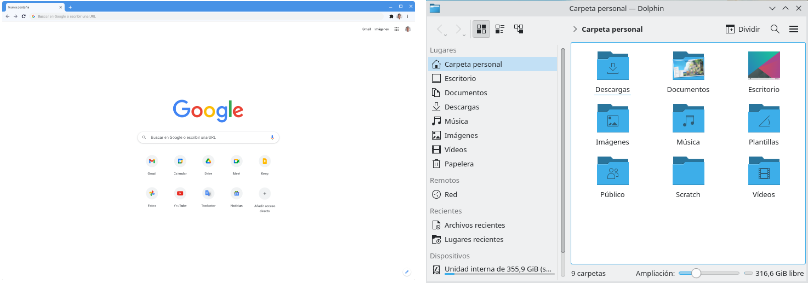
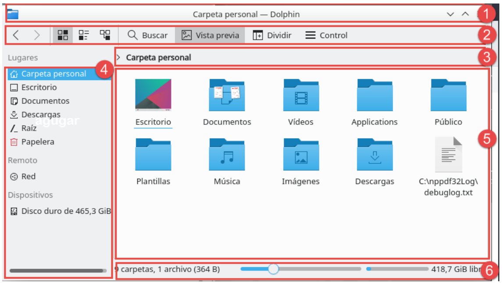
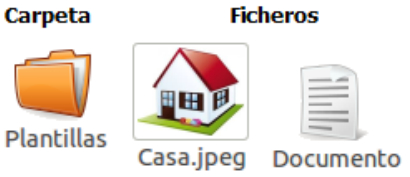
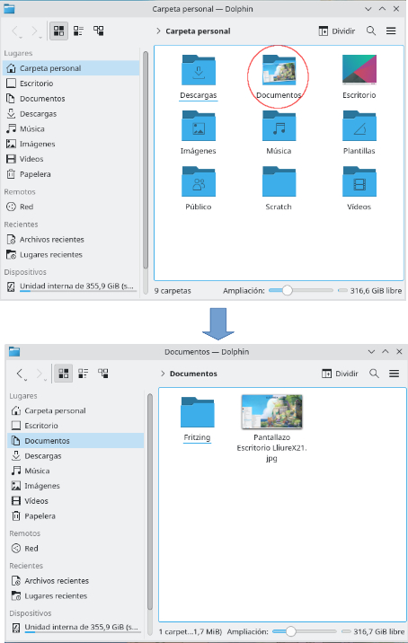
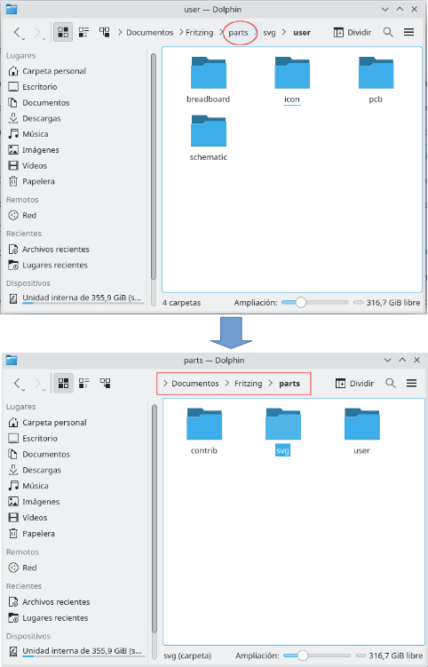
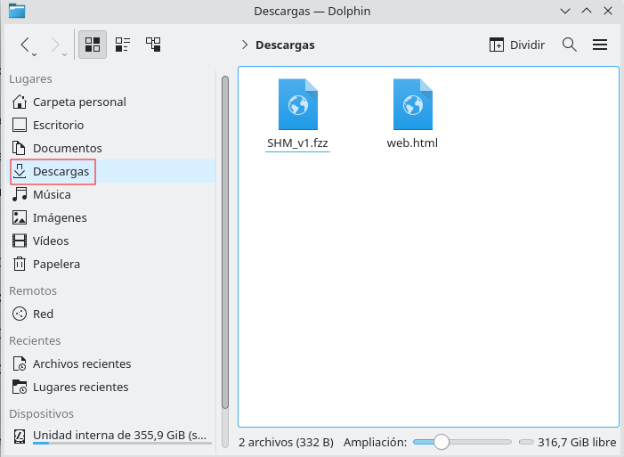
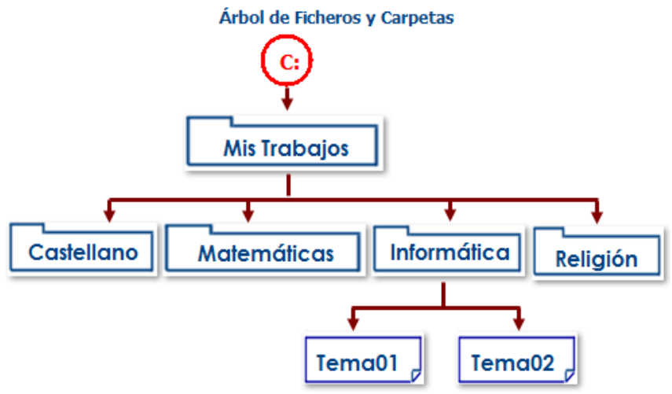
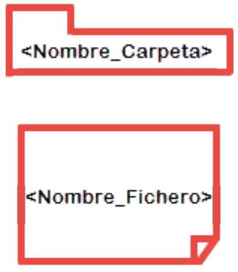

# Organización de la información
{: .no_toc }

## Tabla de contenidos
{: .no_toc }

* TOC
{:toc}

## Introducción

Podemos decir que TODA **la información** en LliureX **se almacena en archivos y** se organiza **en** **carpetas** (directorios).

* **Ficheros:**Al finalizar cualquier trabajo, por ejemplo un escrito, se debe de guardar o almacenar. Solo así se podrá terminar o modificar más tarde. Independientemente del trabajo realizado (un documento, un dibujo, un video, un audio,...) todos ellos acaban empaquetados en un objeto llamado fichero o archivo. Con el paso del tiempo el trabajo del usuario va produciendo una mayor cantidad de ficheros. A medida que su número crece resulta más difícil gestionarlos, por ejemplo, buscar un documento entre tantos ficheros. La gravedad del problema exige una solución, se necesita un sistema que permita organizar de forma eficiente esa gran cantidad de ficheros. La solución son las carpetas.
* **Carpetas:** Una carpeta es una especie de cajón que contiene ficheros. El usuario se puede crear las carpetas que considere necesarias, asignarles un nombre y guardar los ficheros que estime oportunos. De ésta forma es posible organizar los ficheros según el criterio del usuario: por asignaturas, por contenidos, por fechas,... Las carpetas contienen ficheros pero, a su vez, también pueden contener otras carpetas. 
* **El Disco Duro:** La información se empaqueta en ficheros y se organiza en carpetas pero se guarda sobre un “soporte de almacenamiento”, por éste motivo, todo Sistema Informático posee -al menos- un Disco Duro. El Disco Duro se encuentra en el interior de la carcasa y no es visible a simple vista. En el Disco Duro se almacena la siguiente información:
	* Los ficheros del sistema operativo que hace posible que el ordenador arranque y se pueda usar.
	* Los ficheros de los programas que permiten al usuario escribir, dibujar, crear videos,....
	* Los Ficheros del usuario -con sus trabajos-.

La cantidad de ficheros es tal qué, fácilmente pueden superar los miles, es evidente la necesidad de utilizar **carpetas para organizar los ficheros y no mezclarlos.** Aún así las carpetas también son muy numerosas, no obstante, el usuario no debe preocuparse, porque de todas ellas únicamente le interesa “una”, la que contiene sus trabajos y que se llama justamente [**Carpeta Personal**]. **Otros nombres** que se pueden encontrar **para referirse a la Carpeta Personal** son: 

- Carpeta Principal.
- Carpeta del usuario.

### Vídeo: ¿Qué es un archivo?

Mira este vídeo para repasar qué es un **archivo y una carpeta** y en qué lugares se pueden **guardar**:

[👉 Ver el vídeo](https://youtu.be/g5NxT_tywko?si=x9PuLNv6PLFRt-gE)
   
### Actividad

> **EJERCICIO 21:** Realiza este ejercicio en tu libreta digital que has descargado desde la plataforma Web. Recuerda que más tarde el profesor puede preguntarte.
{: .alert-success}

## El explorador de ficheros

Para poder visualizar o explorar el contenido de cualquier dispositivo de almacenamiento, **todos los Sistemas Operativos poseen un programa** o utilidad del tipo **Explorador de Ficheros**. La categoría Explorador de Ficheros está formada por las aplicaciones dedicadas a **ver el contenido de nuestros sistemas de almacenamiento**. Llegados a este punto, **no se deben confundir las categorías Navegador y Explorador** de Ficheros ya que **los Navegadores se utilizan para acceder a Internet**. Ejemplos: Firefox, Chrome, Safari,...

En el caso de LliureX la aplicación puede variar de una versión a otra. A partir de **LliureX 19 el Explorador de Ficheros** es la aplicación **Dolphin**.

**Navegador Chrome a la izquierda y Explorador de Ficheros Dolphin a la derecha (las diferencias son evidentes).**
{: .centrado}

Para **abrir el explorador Dolphin desde LliureX** se ha de pulsar el **botón [Dolphin]** del Panel [Gestión]:

{: .img}

**Botón Dolphin para abrir el Explorador de ficheros en LliureX**
{: .centrado}

Una vez que sabemos cómo abrir el explorador de ficheros Dolphin, vamos a estudiar su **entorno de trabajo**. La siguiente imagen muestra dicho entorno y las zonas más importantes vienen numeradas del 1 al 6:

1. **La barra [Títulos]:**Muestra el nombre de la carpeta activa.
2. **La barra [Herramientas]:** Contiene una serie de botones que son Accesos Rápidos a las principales acciones del menú.
3. **La barra [Direcciones]:** Muestra “entre otra información” el nombre de la carpeta activa.
4. **El panel [Lugares]:** Por defecto muestra una serie de “enlaces” a determinadas carpetas.
5. **El área [Ficheros y Carpetas]:** Muestra el contenido de la carpeta activa. Las carpetas se indican con una miniatura de una carpeta, los ficheros, utilizan diferentes miniaturas en función del contenido:

{: .img}

**6. La barra [Estado]:** Muestra información “variada”, dependiendo de la acción que esté realizando el usuario: espacio libre en el dispositivo de almacenamiento,...

## La carpeta personal

La **Carpeta Personal o Carpeta del Usuario**, es la carpeta que **se abre por defecto al iniciar el Explorador** de ficheros Dolphin. Las **carpetas más importantes** que muestra son las siguientes:

* **Público:** Carpeta reservada para que el usuario deje ficheros a compartir con otros usuarios de la red.
* **Documentos:** Carpeta dónde el alumno/a guarda todos sus trabajos. En caso de guardarse en una carpeta diferente, si el usuario se sienta en otro ordenador no los encontrará. El motivo es muy sencillo, los trabajos guardados en Carpeta Personal se almacenan en el disco duro del ordenador, sin embargo, los guardados en Documentos lo son en el disco duro del servidor.
* **Descargas:** Se almacena la información descargada de Internet.
* **Escritorio:** Carpeta “especial” que contiene las carpetas y ficheros depositados en el escritorio.

Se trata de **carpetas muy importantes para el usuario**, por éste motivo se han añadido en el **panel Lateral**. Es la forma más **rápida y sencilla** de llegar a ellas.

## Acceder al contenido de las carpetas

Para ver el contenido de las carpetas es necesario seguir “explorando”. Son **tres las herramientas a utilizar**:

* **Desde el área [Ficheros y Carpetas]:**Hacer un **doble clic sobre el icono de la carpeta para activarla**. Su contenido pasa a mostrarse en **área [Ficheros]** y, su nombre, se añade a la **barra [Direcciones]**. Resulta muy **útil para recordar el camino seguido hasta el momento así cómo para acceder a una carpeta ya visitada**. En este sentido, durante la exploración de un dispositivo de almacenamiento, puede resultar tentador conocer el contenido de un fichero -> se deberá hacer **doble clic** sobre el icono de un fichero **para ver su contenido:**

{: .img}

**Ver el contenido de la carpeta Documentos haciendo doble click desde el Área de Ficheros y Carpetas.**
{: .centrado}

* **Desde la barra [Direcciones]:** Pulsar sobre el **nombre de una carpeta de la barra [Direcciones] para activarla**. Al pulsar sobre una carpeta de la ruta, **el área pasa a mostrar su contenido pero la ruta permanece intacta** (resulta **útil para volver a alguna de las carpetas anteriores**). Al pulsar sobre una carpeta no visitada, la barra se actualiza:

{: .img}

**En esta imagen se observa cómo acceder a la carpeta 'parts' pinchando en el nombre de esta carpeta (circulo en rojo) desde la barra de Direcciones (rectángulo en rojo).**
{: .centrado}

* **Desde el panel [Lateral]:** Pulsar sobre alguno de los enlaces para activar la carpeta asociada:

{: .img}

**Acceso al contenido de la carpeta 'Descargas' haciendo click en esta carpeta (circulo rojo) del Panel lateral**
{: .centrado}

## Actividad:

[🫱 Actividad](https://es.educaplay.com/juego/13429004-entorno_de_trabajo_de_dolphin.html)

> **EJERCICIO 22:** Realiza este ejercicio en tu libreta digital que has descargado desde la plataforma Web. Recuerda que más tarde el profesor puede preguntarte.
{: .alert-success}

## La ruta de acceso

La ruta de acceso “de un fichero o carpeta” indica el camino a seguir para acceder al fichero o carpeta. Está formada por el nombre de las carpetas que se deben visitar hasta alcanzar el fichero o carpeta.  

### Ejemplo  
La ruta “**Carpeta personal/Documentos/Temario/1ºESO/Tema1.doc**” indica que, para alcanzar el fichero **Tema1.doc** es necesario iniciar la búsqueda en **Carpeta Personal** y seguir por **Documentos, Temario y 1ºESO**  

### Sintaxis
La ruta de acceso debe de respetar la siguiente sintaxis:
  
•  El **primer elemento de la ruta** debe ser **una carpeta** que debe ser reconocible y de fácil acceso al usuario.  
•  Las carpetas se deben **unir con el carácter “/”**. Nunca insertar ni al principio ni al final de la ruta.  
•  El **último objeto de la ruta** debe ser el **fichero o carpeta** buscado.

### Actividad

> **EJERCICIO 23:** Realiza este ejercicio en tu libreta digital que has descargado desde la plataforma Web. Recuerda que más tarde el profesor puede preguntarte.
{: .alert-success}

## Árbol de ficheros y carpetas

Para **describir la información guardada en una “carpeta”**, en vez de utilizar un fragmento de texto describiendo el contenido, se recurre a una **representación gráfica**, un esquema llamado **Árbol de Ficheros y****Carpetas** que resulta más sencillo de leer y comprender. 

### Ejemplo  
La figura siguiente utiliza un **gráfico del tipo Árbol de Ficheros y Carpetas** para mostrar el contenido de la carpeta **MisTrabajos:**

{: .img .img-300}

**Árbol de Ficheros y Carpetas**
{: .centrado}

Como puede observarse en la figura del árbol de ficheros y carpetas, los “elementos” del Árbol poseen una relación del tipo parentesco:

* Por un lado, que la **carpeta** **MisTrabajos** está guardada en el disco duro (que se identifica con la letra **C:**).
* La carpeta **MisTrabajos** **posee cuatro carpetas** que son consideradas cómo **“hijas”** (Castellano, Matemáticas, Informática y Religión). La relación entre las cuatro carpetas es de **“hermana”**.
* La carpeta *Informática* posee dos ficheros (Tema01 y Tema02).

## Proceso para Dibujar el Árbol de una Carpeta

Para **dibujar el esquemas en árbol de ficheros y carpetas** como el anterior, podemos seguir los siguientes **pasos**:

1. Indicar el **nombre del esquema**.  
2. Debajo del nombre, encerrado en un círculo, **señalar la unidad/****dispositivo** dónde se almacenan los ficheros y carpetas (en el ejemplo de la figura era **C:**).  
3. **Unir con una línea el círculo y el nombre de la carpeta** cuyo contenido se desea representar. Se llama **carpeta raíz** (en el caso de la figura, la carpeta raíz es **MisTrabajos**).
4. Las **carpetas y los ficheros** los deberás **dibujar según las formas** que se indican **en la figura siguiente**:

{: .img .img-300}

**Formas para representar el Fichero y la Carpeta**
{: .centrado}

5. **Colgar de la raíz todos sus hijos** de forma que estén alineados (ver la figura de ejemplo del **árbol de ficheros y carpetas**).  
6. Expandir los **hijos del tipo carpeta**.

### Actividad

> **EJERCICIO 24:** Realiza este ejercicio en tu libreta digital que has descargado desde la plataforma Web. Recuerda que más tarde el profesor puede preguntarte.
{: .alert-success}

## Vídeo: Crear un árbol de ficheros y carpetas en LliureX

Mira este vídeo donde, se explica **cómo crear** en el Sistema operativo LliureX **el árbol de Ficheros y Carpetas** que tienes en el ejemplo anterior:

[👉 Ver el vídeo](https://youtu.be/BAbz4lFGZXg?si=FUNaxVr2mhfK9_Cl)

### Actividad

> **EJERCICIO 25:** Realiza este ejercicio en tu libreta digital que has descargado desde la plataforma Web. Recuerda que más tarde el profesor puede preguntarte.**
{: .alert-success}

[👈 Atrás](./introduccion)
[👉 Siguiente](./operaciones_bsicas_con_carpetas)