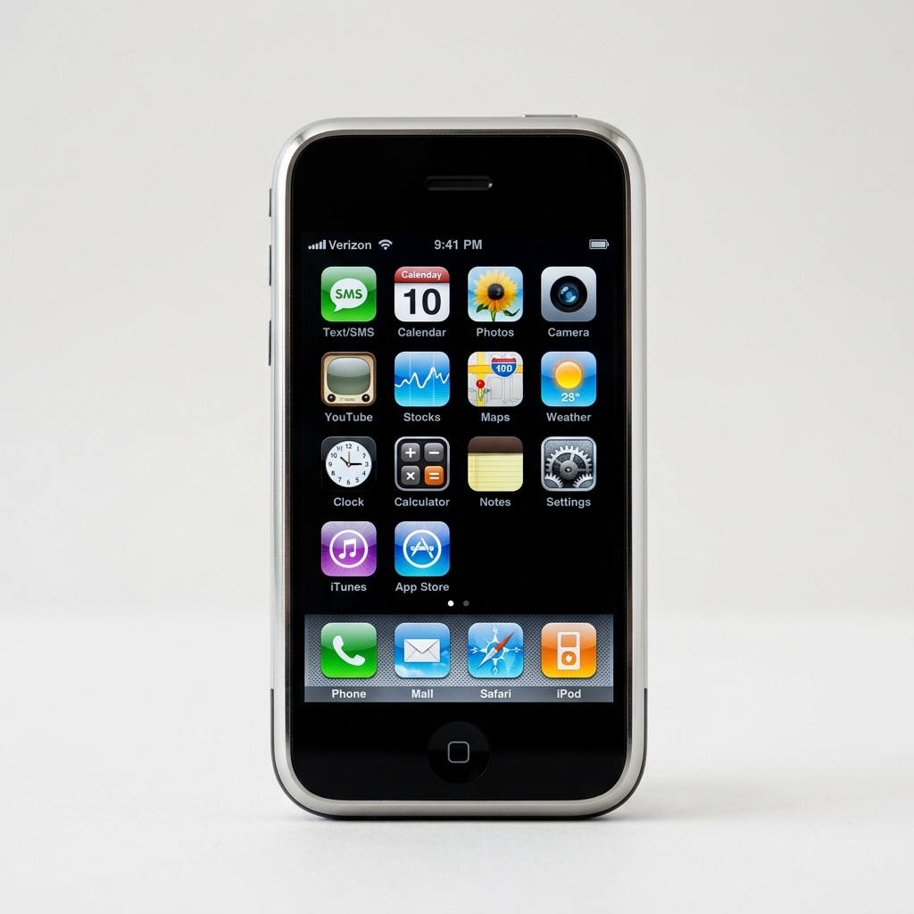
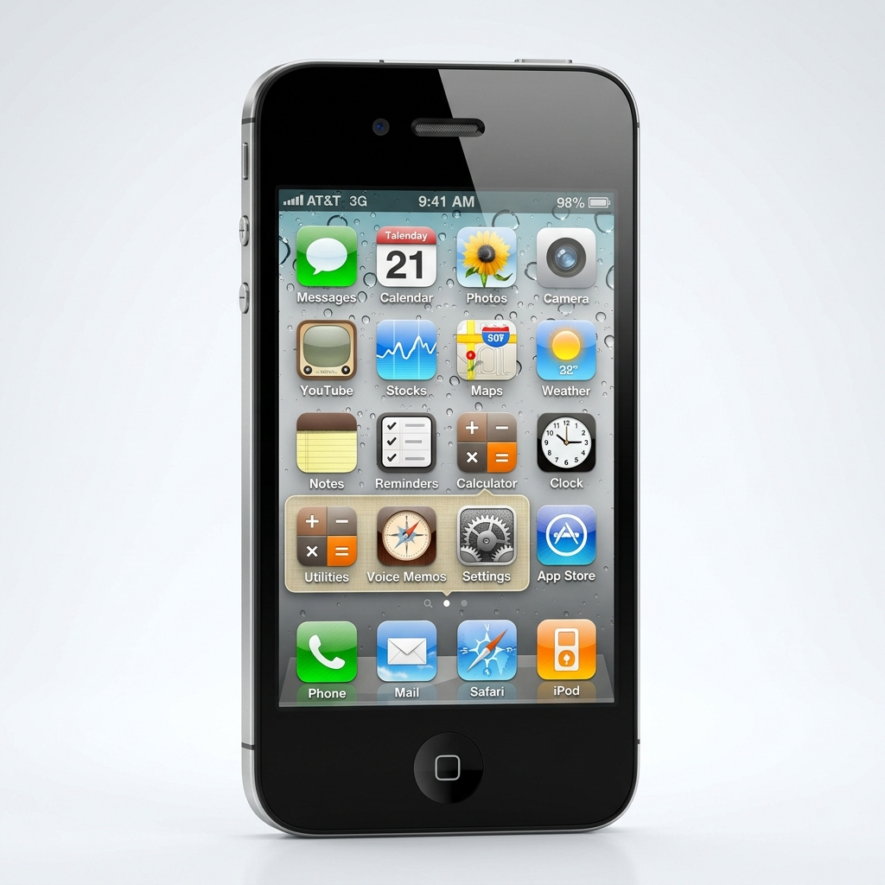
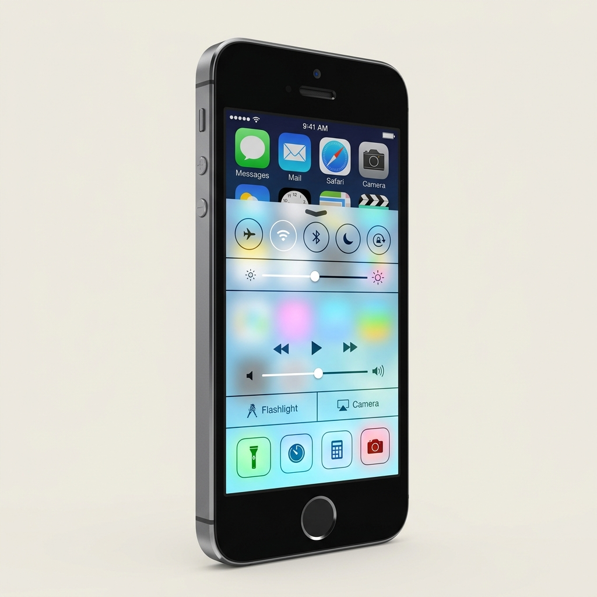
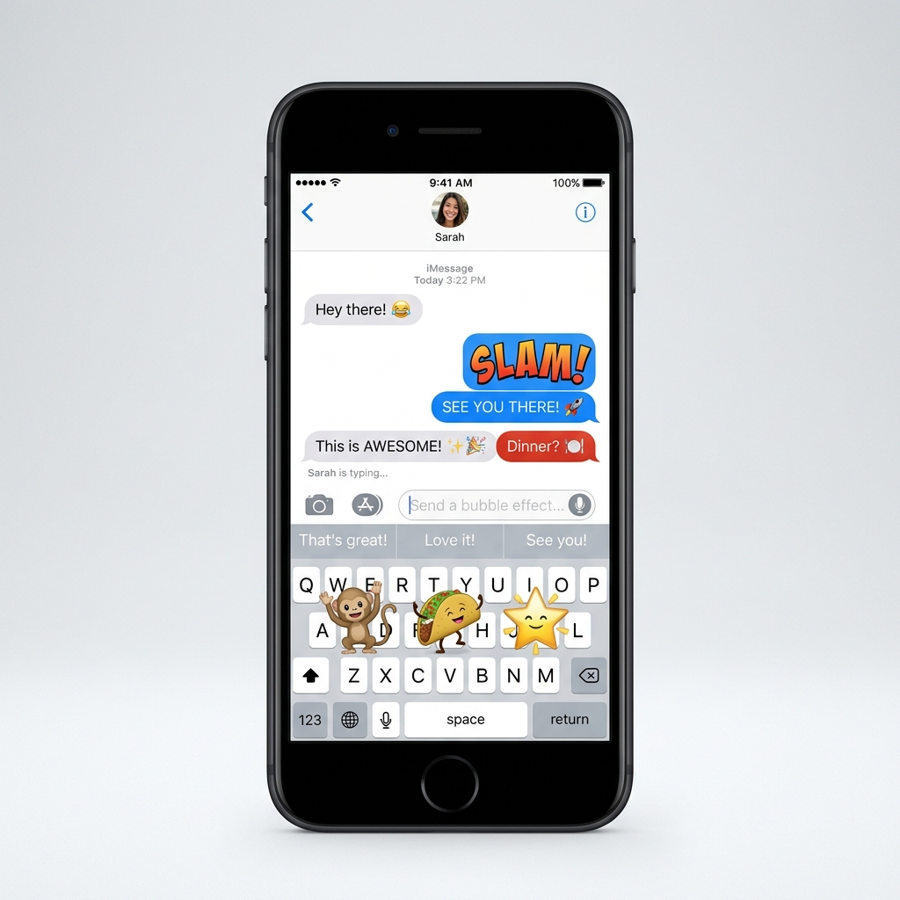
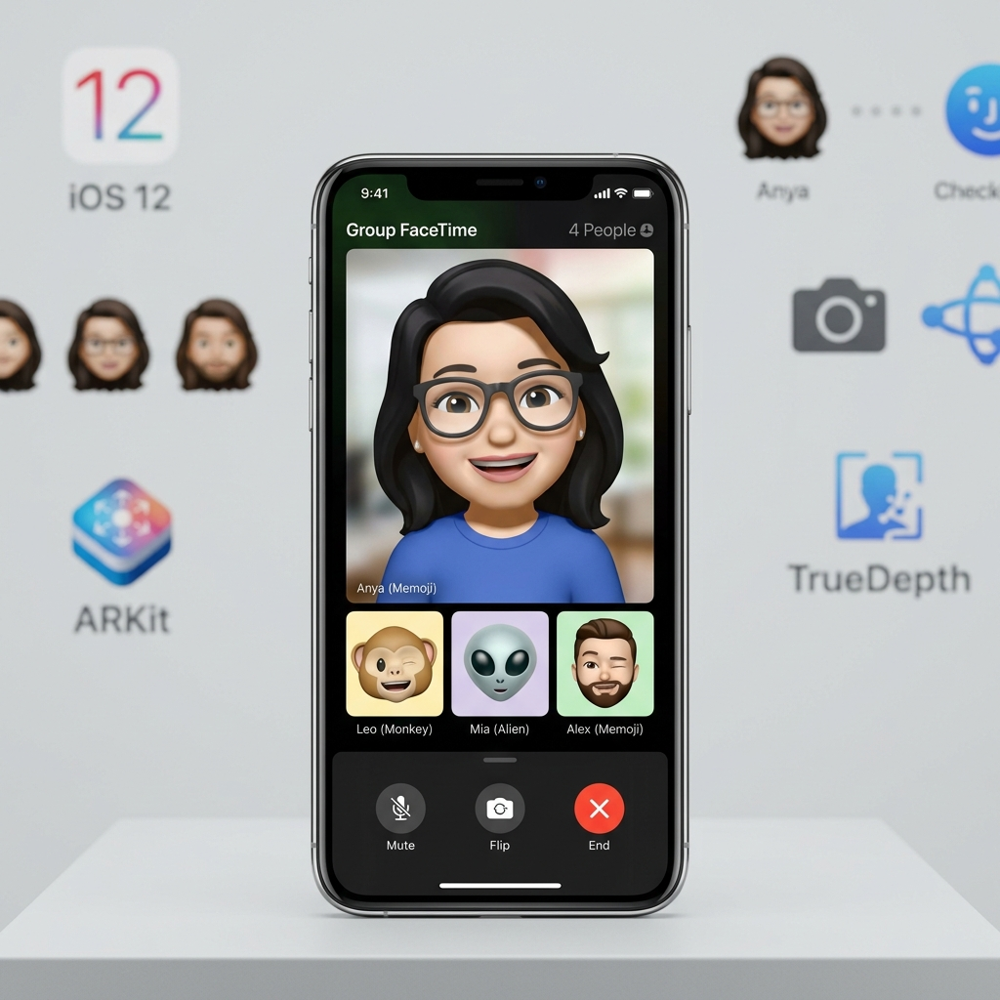
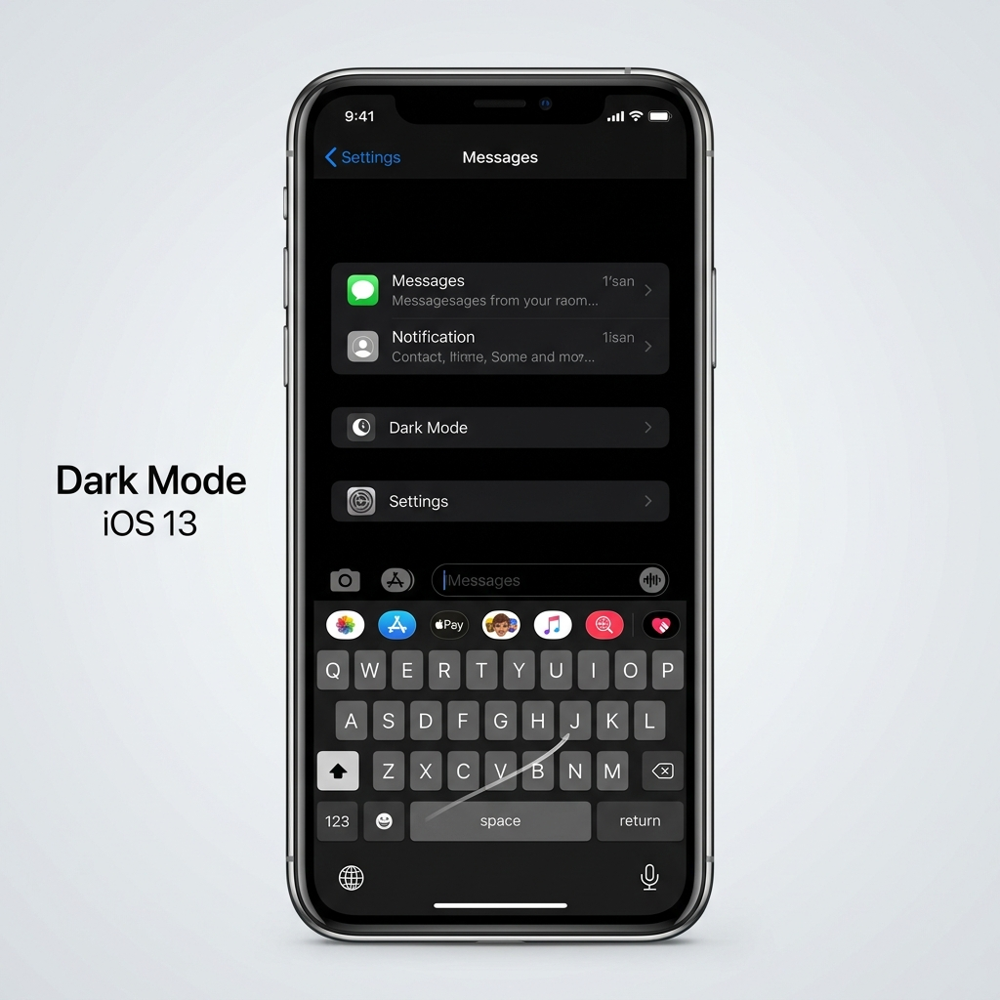
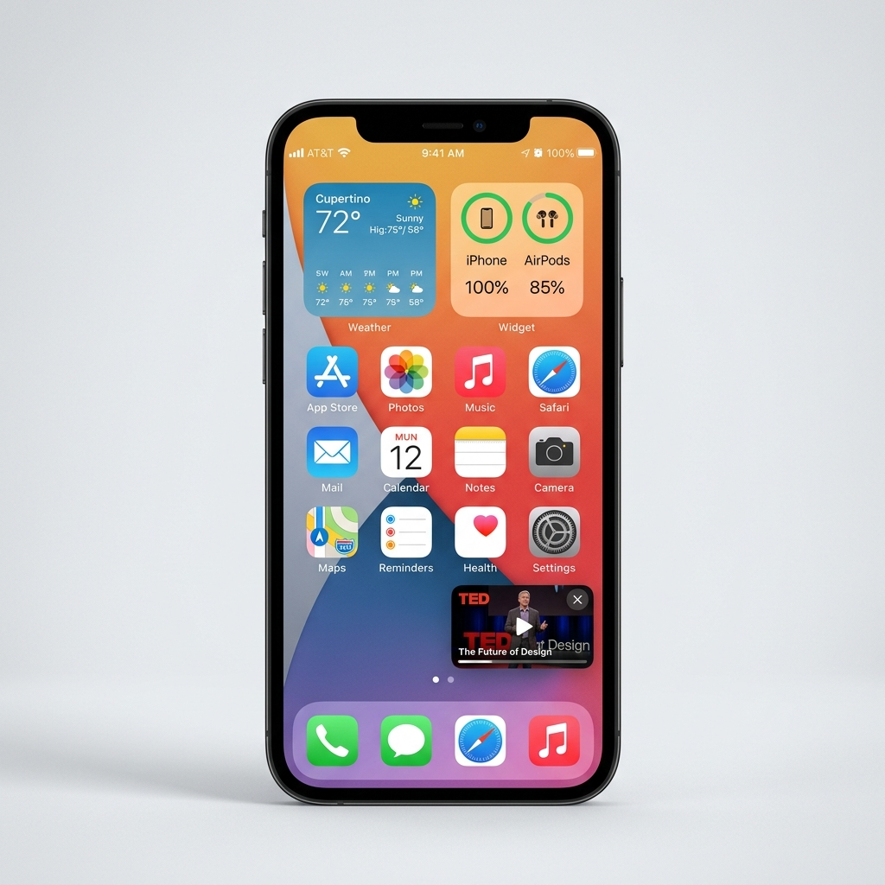
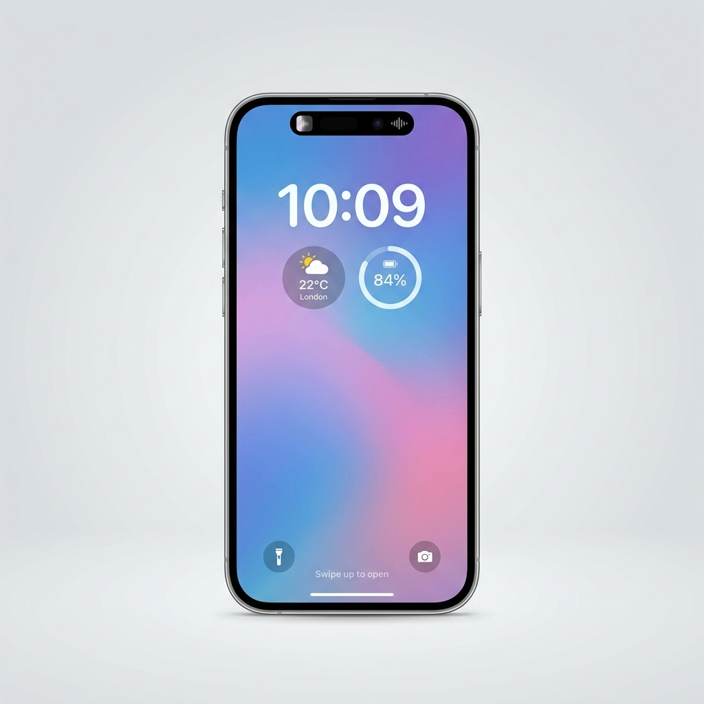
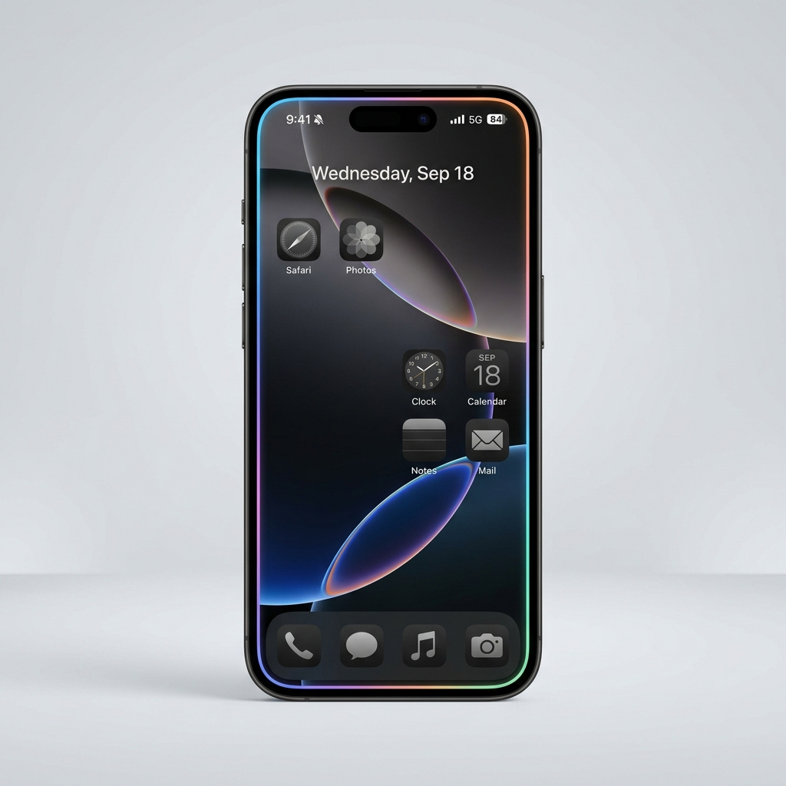
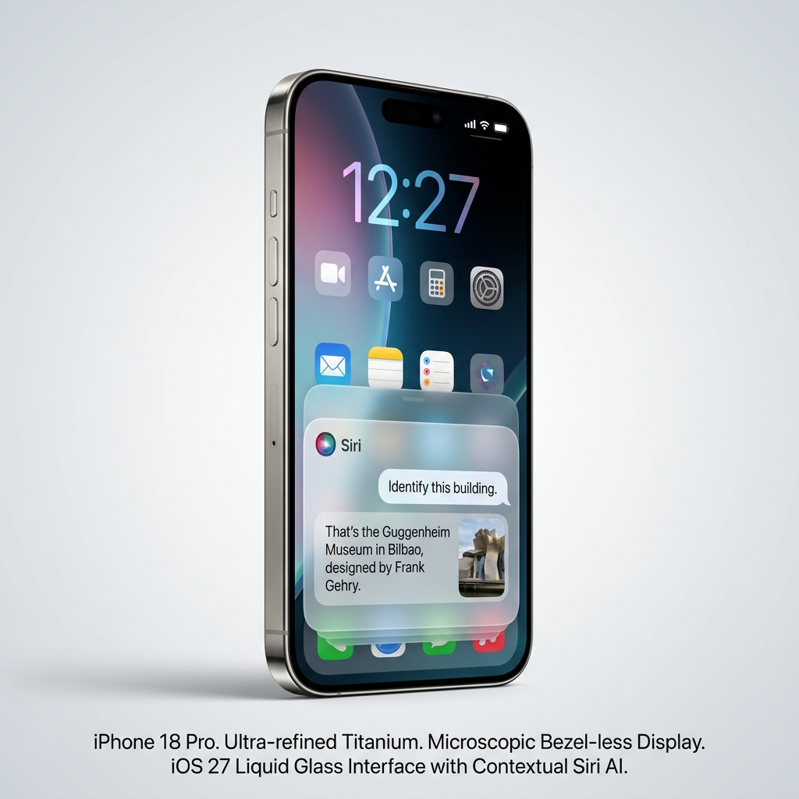

# La historia de iOS: El sistema operativo que nació con el iPhone

> **Si lo prefieres**, puedes ver el siguiente [🎥 Vídeo](https://youtu.be/iuWITy1IHSM?si=I3vhS3TwYBQBagYf) donde queda explicada la historia de iOS desde sus inicios hasta iOS 13 (2019). 
{: .alert-info}

## 🍏 La idea de partida

Es habitual oír que el iPhone es un gran teléfono **a pesar de** no ofrecer, sobre el papel, las mismas prestaciones que algunos rivales de su competencia. La explicación de esa aparente contradicción es sencilla: los componentes no lo son todo. Un buen conjunto de piezas necesita un **sistema operativo bien ajustado** para exprimir el dispositivo, y ahí es donde Apple ha hecho históricamente su mejor trabajo: encajar hardware y software en un mismo producto.

De esa combinación nació el sistema operativo que acompaña al iPhone desde el primer día y que acabó convirtiéndose en el gran rival del Android de Google.

---

## 🗓️ Línea de tiempo rápida

Esta tabla **solo sitúa cada versión en el tiempo**. Las novedades están explicadas después, en el texto.

| Año aprox. | Versión | Se estrenó con… |
|---|---|---|
| 2007 | iPhone OS (sin número) | El primer iPhone |
| 2008 | iPhone OS 2 | iPhone 3G |
| 2009 | iPhone OS 3 | iPhone 3GS |
| 2010 | iOS 4 | iPhone 4 y iPad 2 |
| 2011 | iOS 5 | iPhone 4S |
| 2012 | iOS 6 | iPhone 5 y iPad mini |
| 2013 | iOS 7 | iPhone 5s y 5c, iPad y iPad mini 2 |
| 2014 | iOS 8 | iPhone y iPad de aquel año |
| 2015 | iOS 9 | iPhone 6s y 6s Plus, primer iPad Pro |
| 2016 | iOS 10 | iPhone de aquel año |
| 2017 | iOS 11 | iPhone de aquel año |
| 2018 | iOS 12 | iPhone X, XR y XS |
| 2019 | iOS 13 | iPhone 11 y 11 Pro |
| 2020 | iOS 14 | iPhone 12 |
| 2021 | iOS 15 | iPhone 13 |
| 2022 | iOS 16 | iPhone 14 |
| 2023 | iOS 17 | iPhone 15 |
| 2024 | iOS 18 | iPhone 16 |
| 2025 | iOS 26 (sí, 26) | iPhone 17 |
| 2026 | iOS 27 | iPhone 18 Pro (versión actual) |

---

## iPhone OS · 2007 — El estreno: un sistema sin nombre

El mundo vio por primera vez el software de Apple para móviles el **9 de enero de 2007**, cuando Steve Jobs presentó el primer iPhone. Lo que aquel teléfono era capaz de hacer resultaba casi mágico para la época.

Además de lo que ya ofrecía cualquier móvil de entonces —alarmas, mensajes, reloj, cronómetro, calendario y otras tareas básicas—, aportaba tres cosas que marcaron la diferencia: el manejo mediante **gestos sobre una pantalla multitáctil**, la navegación por internet con el navegador **Safari** y una **aplicación de YouTube instalada de fábrica** para ver vídeos.

Un detalle curioso: aquel sistema **no tenía un nombre definido**. Todo el mundo acabó llamándolo, sencillamente, *iPhone OS*.

En **enero de 2008** llegó una gran actualización que permitía **repartir las aplicaciones entre distintas pantallas** de inicio. Quienes tenían un iPod touch recibieron además las aplicaciones de correo, mapas (que, por cierto, eran los de Google), notas, bolsa y tiempo.

> 💸 **Dato para pensar:** aquella actualización era gratuita para los usuarios de iPhone, pero los del iPod touch tenían que **pagar 20 dólares** por instalarla. Hoy resultaría impensable.

---

## iPhone OS 2 · 2008 — La llegada de la tienda de aplicaciones

La segunda entrega —que muchos daríamos por hecho que se llamó "iOS 2", pero que siguió sin nombre propio— llegó de la mano del **iPhone 3G**.

Su gran aportación, la que cambió el modelo de negocio para siempre, fue la **tienda de aplicaciones**, esa *App Store* que seguimos usando hoy. Junto a ella, la aplicación de mapas por fin hacía juego con el **GPS** del teléfono, y el correo empezó a recibir **notificaciones push**.

Los usuarios de iPod touch volvieron a pasar por caja: 10 dólares esta vez.

---

## iPhone OS 3 · 2009 — Voz, búsqueda… y copiar y pegar

La tercera versión se presentó en **2009** junto al **iPhone 3GS**. Entre sus novedades principales estuvieron el **control por voz**, los **mensajes multimedia** y una herramienta de búsqueda interna llamada **Spotlight**, que permitía localizar aplicaciones o archivos guardados en el propio dispositivo. También se pudo por fin **girar el teléfono y usarlo en horizontal**.

Y una función que hoy parece obvia pero que hasta entonces no existía en estos teléfonos: **copiar, cortar y pegar**. Es muy probable que tu primer móvil ya lo hiciera; el iPhone tardó tres versiones en incorporarlo.

> 🏷️ **El cambio de nombre.** En **2010**, cuando Apple mostró por primera vez el iPad, se dejó atrás la denominación *iPhone OS* y el sistema pasó a llamarse **iOS**, el nombre que todos conocemos. Los usuarios de iPad tuvieron que pagar otros 10 dólares para actualizar… y fue **la última vez** que una actualización del sistema costó dinero.

---

## iOS 4 · 2010 — El primer gran salto

Esta cuarta versión venía preinstalada en el **iPhone 4** y en el **iPad 2**, y supuso uno de los avances más importantes del sistema.

Por fin se podían poner **fondos de pantalla en el menú de inicio**. Apareció la **multitarea**, es decir, la posibilidad de tener varias aplicaciones funcionando a la vez. Se podían **agrupar las aplicaciones en distintas carpetas**. Llegaron las **videollamadas mediante FaceTime**. Y se incorporó la aplicación de lectura *iBooks* para iPad, que hoy conocemos simplemente como **Libros**.

---

## iOS 5 · 2011 — Un asistente que escucha

Estrenada con el **iPhone 4S**, su protagonista indiscutible fue **Siri**, el asistente virtual de Apple que sigue vigente hoy.

Se sumó también un **centro de notificaciones** que reunía de forma ordenada todo lo que llegaba al dispositivo, y un servicio de **mensajería gratuita entre dispositivos de Apple**. Conviene recordar el contexto: **aún no existía WhatsApp** y las aplicaciones de mensajería no eran tan accesibles, así que poder enviar textos y contenido multimedia sin pagar por cada mensaje era una ventaja enorme.

Aparecieron además la aplicación de **recordatorios** y *Newsstand*, el **Kiosco** de prensa digital, una de esas aplicaciones que casi nadie llegó a saber para qué servía.

Dos novedades de fondo, muy relevantes:

- Las **actualizaciones por aire** (*OTA*): a partir de aquí se podía actualizar el sistema **sin conectar el dispositivo al ordenador**.
- El servicio de **nube iCloud**, que nació con problemas: su seguridad no fue precisamente su punto fuerte y llegaron a filtrarse fotografías privadas de actrices conocidas.

---

## iOS 6 · 2012 — Apple y Google se separan

Esta versión se introdujo con el **iPhone 5** y el **iPad mini de primera generación**, y lo más importante que ocurrió no fue una función nueva, sino una **ruptura**: la **separación de los servicios de Google** respecto de los dispositivos de Apple.

Hasta entonces, tanto YouTube como el sistema de mapas —operado por Google— venían instalados de serie como aplicaciones nativas. A partir de aquí, Apple apostó por **su propia aplicación de mapas**, que en su estreno (y para muchos, todavía hoy) no llegaba al nivel de la de Google; y quien quisiera YouTube tenía que **buscarlo en la tienda de aplicaciones**.

Más allá de eso, la actualización no trajo grandes mejoras ni funciones que renovaran el sistema. Las consecuencias internas fueron serias: **varias personas del equipo directivo fueron despedidas** y se contrató a un nuevo vicepresidente de diseño, que sería quien firmase la siguiente entrega.

---

## iOS 7 · 2013 — El rediseño que lo cambió todo

Fue una de las actualizaciones **más innovadoras** de la historia del sistema, y su rasgo definitorio fue el **diseño**. Era algo que urgía: mientras la competencia ya apostaba por estéticas muy minimalistas, Apple seguía arrastrando un aspecto viejo y aburrido. Venía preinstalada en los **iPhone 5s y 5c**, el iPad y el iPad mini de segunda generación.

Otras incorporaciones importantes:

- El **centro de control**, que ponía a mano accesos directos para las tareas más habituales.
- **AirDrop**, que permite **compartir todo tipo de archivos entre dispositivos de la marca** de forma muy sencilla. Sigue siendo una de las funciones favoritas de muchos usuarios.
- Un **rediseño de la aplicación de fotos**, con mayor control sobre la biblioteca.
- **iTunes Radio**.
- La primera integración del sistema **en algunos vehículos**, con *CarPlay*.

---

## iOS 8 · 2014 — Año de ajustes

Aquí los cambios no fueron mayores: esta entrega se dedicó sobre todo a **corregir y pulir defectos de la versión anterior**. Aun así, dejó cosas útiles.

Llegó la **integración entre aplicaciones mediante un menú de compartir**, que benefició especialmente a los usuarios de iPad: muchos empezaron a dejar de lado el portátil y a usar la tableta como ordenador principal. Se añadieron la función **En familia** (que tardó en llegar a algunos países), el almacenamiento **iCloud Drive** para guardar archivos en la nube y el soporte para **teclados de terceros**.

Y una apuesta de peso: **Apple Music**, el servicio de música en *streaming* con el que la marca salió a competir directamente contra Spotify.

---

## iOS 9 · 2015 — Pulir lo anterior y estrenar el iPad Pro

Con el afán de acercarse al sistema perfecto, esta novena versión siguió **puliendo errores y completando funciones** presentadas en las dos entregas anteriores, así que tampoco trajo cambios muy grandes. Se presentó con los **iPhone 6s y 6s Plus**.

Entre lo concreto: mejoras en la aplicación de **notas**, indicaciones de **transporte público** en los mapas y varios **cambios de nombre** de aplicaciones (el antiguo *Newsstand* pasó a llamarse *News* y *Passbook* se convirtió en *Wallet*).

La novedad más llamativa llegó con el primer **iPad Pro**: la **imagen dentro de imagen** (*picture in picture*), que permite **seguir reproduciendo un vídeo por encima de cualquier aplicación** que estés usando, aprovechando así las pantallas grandes.

---

## iOS 10 · 2016 — Las puertas se abren a los desarrolladores

Esta décima versión se caracterizó por **abrirse a los desarrolladores externos**. El resultado práctico fue que a partir de entonces se pudieron hacer cosas como **enviar mensajes de WhatsApp dictándoselos a Siri** o **recibir llamadas de aplicaciones de terceros desde la propia aplicación de teléfono**.

En la aplicación de mensajes aparecieron los **stickers**, que al principio no fueron tan famosos.

Y una novedad que gustó a casi todo el mundo: la posibilidad de **eliminar las aplicaciones nativas** del sistema que no se utilizaran (la de bolsa era la candidata favorita).

---

## iOS 11 · 2017 — Cámara, códigos y casa inteligente

Esta undécima versión se estrenó en **2017** con una **tienda de aplicaciones rediseñada**.

**Siri dejó de hablar como un robot** y pasó a tener una pronunciación mucho más natural. En la cámara se incorporó el **modo retrato** para algunos dispositivos y la capacidad de **escanear códigos QR** directamente. En fotos se añadió la **compatibilidad con imágenes animadas**, algo que probablemente debería haber existido mucho antes.

También apareció *HomeKit*, la aplicación que después se llamaría **Casa**, pensada para interactuar con dispositivos inteligentes del hogar: enchufes, ventiladores, altavoces…

---

## iOS 12 · 2018 — Caras que se mueven y llamadas multitudinarias

La duodécima entrega incorporó los famosos **Animojis**, esos personajes animados que **imitaban los gestos de tu cara**, aunque solo funcionaban en el iPhone X, el XR y el XS.

Las videollamadas de **FaceTime** pasaron a admitir **grupos de hasta 32 personas**. Se añadieron los **atajos**, junto con el modo **No molestar**, que además podía activarse de forma automática. Y se incorporó información detallada y herramientas de **gestión de la batería**.

---

## iOS 13 · 2019 — Modo oscuro y caminos que se separan

Llegamos a la última versión que cubre el vídeo. Se estrenó con los **iPhone 11 y 11 Pro** y trajo una decisión de calado: **el sistema del iPhone y el del iPad se separaron**. El de la tableta pasó a llamarse **iPadOS** e incorpora funciones pensadas específicamente para ese formato.

Su característica más celebrada fue el **modo oscuro**, una de las funciones más esperadas por los usuarios, que amplió mucho las opciones de personalización del dispositivo.

Otras novedades:

- **Escribir deslizando el dedo** sobre el teclado. No era una idea nueva —muchos dispositivos Android ya la ofrecían—, pero Apple decidió incorporarla aquí.
- Más opciones de **edición de fotos** y **mejor rendimiento** que en la versión anterior.
- **Apple Arcade**, una **suscripción de juegos** de pago.
- La posibilidad de **descargar aplicaciones pesadas usando la red de datos móviles**.
- **Carga de batería optimizada**.
- Una versión renovada de **CarPlay**.

---

## iOS 14 · 2020 — La pantalla de inicio se reinventa

Llegó en **septiembre de 2020** y venía preinstalada en los **iPhone 12**. Su novedad más visible afectaba a algo que apenas había cambiado desde 2007: **la pantalla de inicio**.

Por primera vez se podían colocar **widgets de distintos tamaños entre los iconos**, es decir, recuadros que muestran información actualizada (el tiempo, la batería, el calendario) sin necesidad de abrir la aplicación. Además apareció la **biblioteca de aplicaciones**, una pantalla final donde el sistema **ordena automáticamente por categorías** todo lo que tienes instalado, lo que permitió empezar a esconder pantallas enteras de iconos.

Otras incorporaciones destacadas:

- La **imagen dentro de imagen llegó por fin al iPhone** (hasta entonces era exclusiva del iPad): puedes seguir viendo un vídeo en una esquina mientras usas otra aplicación.
- Las **llamadas entrantes y Siri dejaron de ocupar toda la pantalla** y pasaron a aparecer como un aviso pequeño en la parte superior.
- Los **fragmentos de aplicación** (*App Clips*): usar una parte de una aplicación —pagar un aparcamiento, alquilar un patinete— **sin llegar a instalarla**.
- Una aplicación propia de **traducción**.
- Mejoras de privacidad importantes: un **punto de color avisa cuando una aplicación está usando la cámara o el micrófono**, y se puede dar la ubicación **aproximada** en lugar de la exacta.

---

## iOS 15 · 2021 — Concentración y texto que se lee solo

Estrenada con el **iPhone 13**, esta versión se centró en dos ideas: **comunicarse mejor** y **distraerse menos**.

Las videollamadas de **FaceTime** dieron un salto: se podían crear **enlaces de invitación** para que se uniera cualquier persona, incluso desde Android o Windows a través del navegador; apareció **SharePlay** para ver una serie o escuchar música a la vez que otra persona durante la llamada; y el audio mejoró con la **cancelación del ruido de fondo**.

La segunda gran idea fueron los **modos de concentración**: perfiles (trabajo, estudio, sueño…) que **filtran qué notificaciones pueden molestarte** en cada momento, acompañados de un **resumen de notificaciones** que agrupa lo menos urgente y te lo entrega a una hora concreta.

También llegó el **texto en vivo**: la cámara **reconoce el texto que aparece en una foto** y permite copiarlo, traducirlo o llamar directamente a un número fotografiado. Safari se rediseñó colocando la barra de direcciones abajo, al alcance del pulgar, y organizando las pestañas en grupos. Y los mapas estrenaron vistas en **tres dimensiones** de las grandes ciudades.

---

## iOS 16 · 2022 — La pantalla de bloqueo se personaliza

Con el **iPhone 14**, el protagonismo pasó a la **pantalla de bloqueo**, que se volvió completamente personalizable: se puede cambiar la **tipografía y el color de la hora**, añadir **widgets con información a simple vista** y guardar **varias pantallas distintas**, cada una asociada a un modo de concentración.

Otras novedades de peso:

- En mensajes, por fin se podía **editar un mensaje ya enviado o cancelar el envío** durante unos minutos, además de marcar conversaciones como no leídas.
- Las **actividades en vivo**: avisos que se actualizan solos en la pantalla de bloqueo (el resultado de un partido, el repartidor que trae tu pedido). En los modelos Pro se integraron en la **isla dinámica**, el recorte de la pantalla convertido en interfaz.
- **Recortar el sujeto de una fotografía** separándolo del fondo con solo mantener el dedo encima.
- Las **claves de acceso** (*passkeys*), un sistema pensado para **sustituir las contraseñas** usando Face ID o Touch ID.

---

## iOS 17 · 2023 — El iPhone como objeto de escritorio

Estrenada con el **iPhone 15** (el primero con conector USB-C), esta versión apostó por lo cotidiano más que por las grandes revoluciones.

Su función más llamativa fue el **modo escritorio** (*StandBy*): al dejar el teléfono **cargando y en horizontal**, la pantalla se convierte en un reloj grande, un marco de fotos o un panel de información visible a distancia, útil en la mesilla de noche.

Además:

- Los **pósters de contacto**: diseñas cómo se ve tu nombre y tu foto **en la pantalla de la persona a la que llamas**.
- **NameDrop**: **acercar dos iPhone** para intercambiar los datos de contacto al instante.
- El **buzón de voz en directo**: mientras alguien deja un mensaje, **ves en pantalla lo que está diciendo** y decides si contestar.
- **Compartir llegada**: el teléfono **avisa automáticamente a un contacto cuando llegas** a tu destino, y también si te detienes por el camino.
- Una aplicación de **diario personal** y un **corrector automático** notablemente mejorado.

---

## iOS 18 · 2024 — Personalizar hasta el último icono

Llegó en **septiembre de 2024** junto al **iPhone 16**, y llevó la personalización al extremo: las aplicaciones y los widgets se pueden **colocar en cualquier hueco de la pantalla**, dejando espacios vacíos si quieres, y los iconos admiten **modo oscuro, tamaño grande o un tinte de color** a tu gusto.

El **centro de control** también se rehízo: ahora se organiza en **varias páginas por grupos** (música, conectividad, hogar), admite controles de otras aplicaciones y permite **cambiar los dos botones fijos de la pantalla de bloqueo**.

El resto de novedades importantes:

- **Bloquear u ocultar aplicaciones** detrás de Face ID, de modo que su contenido no aparezca ni siquiera en las búsquedas.
- Una aplicación de **fotos rediseñada**, que agrupa automáticamente los recuerdos en colecciones.
- La llegada de **Apple Intelligence**, el conjunto de funciones de **inteligencia artificial** de la marca: herramientas de escritura, resúmenes de notificaciones, borrado de objetos en las fotos… Se desplegó **poco a poco y por idiomas**, y tardó en llegar al español.
- Compatibilidad con **RCS**, el estándar que mejora los mensajes **entre iPhone y Android** (fotos en buena calidad, confirmaciones de lectura), y una aplicación propia de **contraseñas**.

---

## iOS 26 · 2025 — El salto de numeración y el "cristal líquido"

Aquí hay que parar un momento, porque **después de la 18 no vino la 19**.

> 🔢 **¿Por qué se pasó de iOS 18 a iOS 26?**
> En 2025 Apple abandonó la numeración correlativa y pasó a usar **el año de la temporada**, igual que hacen los coches o los videojuegos deportivos. La versión presentada en 2025 cubre el curso que va **de septiembre de 2025 a septiembre de 2026**, así que se llama **iOS 26**. La ventaja: **todos sus sistemas comparten ya el mismo número** (iOS 26, iPadOS 26, macOS 26, watchOS 26), en lugar de la mezcla confusa de cifras que había antes.

Esta versión, estrenada con el **iPhone 17**, trajo el **mayor cambio de aspecto desde 2013**: un lenguaje visual llamado **"cristal líquido"** (*Liquid Glass*), con menús y botones **translúcidos que refractan la luz y el color** de lo que hay debajo, imitando el comportamiento del cristal real.

En cuanto a funciones:

- **Traducción en directo** integrada en mensajes, llamadas y FaceTime: el sistema **traduce sobre la marcha** lo que te escriben o te dicen.
- **Filtrado de llamadas**: ante un número desconocido, el teléfono **contesta por ti y pregunta quién llama** antes de hacerte sonar.
- Una aplicación de **cámara simplificada**, con los ajustes menos usados escondidos.
- Una nueva aplicación de **juegos** que reúne tu biblioteca y la suscripción Apple Arcade.
- **Inteligencia visual**, capaz de **analizar lo que se ve en la pantalla** y buscar información sobre ello.

---

## iOS 27 · 2026 — La versión actual

Se publicó el **14 de septiembre de 2026** y viene instalada en los **iPhone 18 Pro**. Es compatible con modelos desde el **iPhone 11** en adelante.

Su gran protagonista es **el nuevo Siri**, reconstruido sobre inteligencia artificial: mantiene **conversaciones seguidas** (puedes repreguntar sin empezar de cero), **se le puede escribir** en vez de hablarle, guarda el historial de lo que le has pedido y accede a tus datos personales para **completar tareas complejas**. Eso sí, con limitaciones al arrancar: solo en inglés y solo en los modelos más recientes.

Otras novedades:

- **Inteligencia visual desde la cámara**: apuntas con el móvil, o le pasas una captura de pantalla, y preguntas sobre lo que aparece.
- **Ajustes del "cristal líquido"** introducido el año anterior, con **mejor contraste** y la posibilidad de regular cuánta transparencia quieres. Una respuesta directa a las críticas de legibilidad.
- **Mejoras notables de rendimiento**: según Apple, las aplicaciones abren hasta un 30 % más rápido, las fotos cargan hasta un 70 % antes y las transferencias por AirDrop son hasta un 80 % más veloces.
- **Continuidad entre dos iPhone** que comparten el mismo número de teléfono.
- Un botón de **"avísame"** en Safari: el navegador **vigila una web por ti** y te avisa cuando cambie.
- **Vista horizontal** en muchas más aplicaciones del sistema y **controles parentales** renovados.

---

> 📅 Documento actualizado en **septiembre de 2026**. Si lo lees más adelante, comprueba cuál es la versión vigente: sale una nueva **cada septiembre**.
